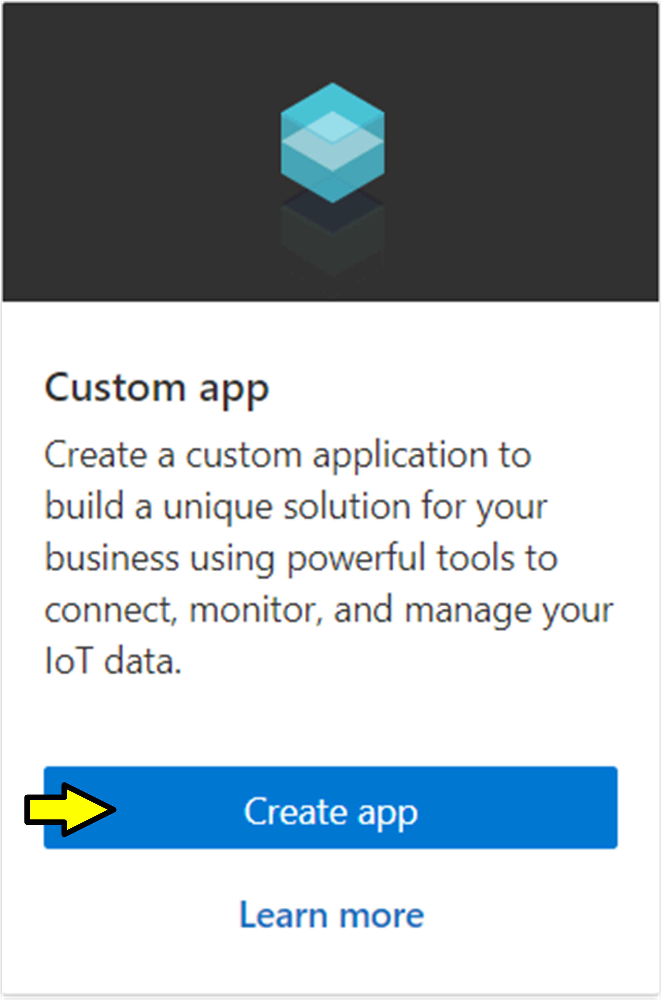
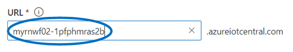
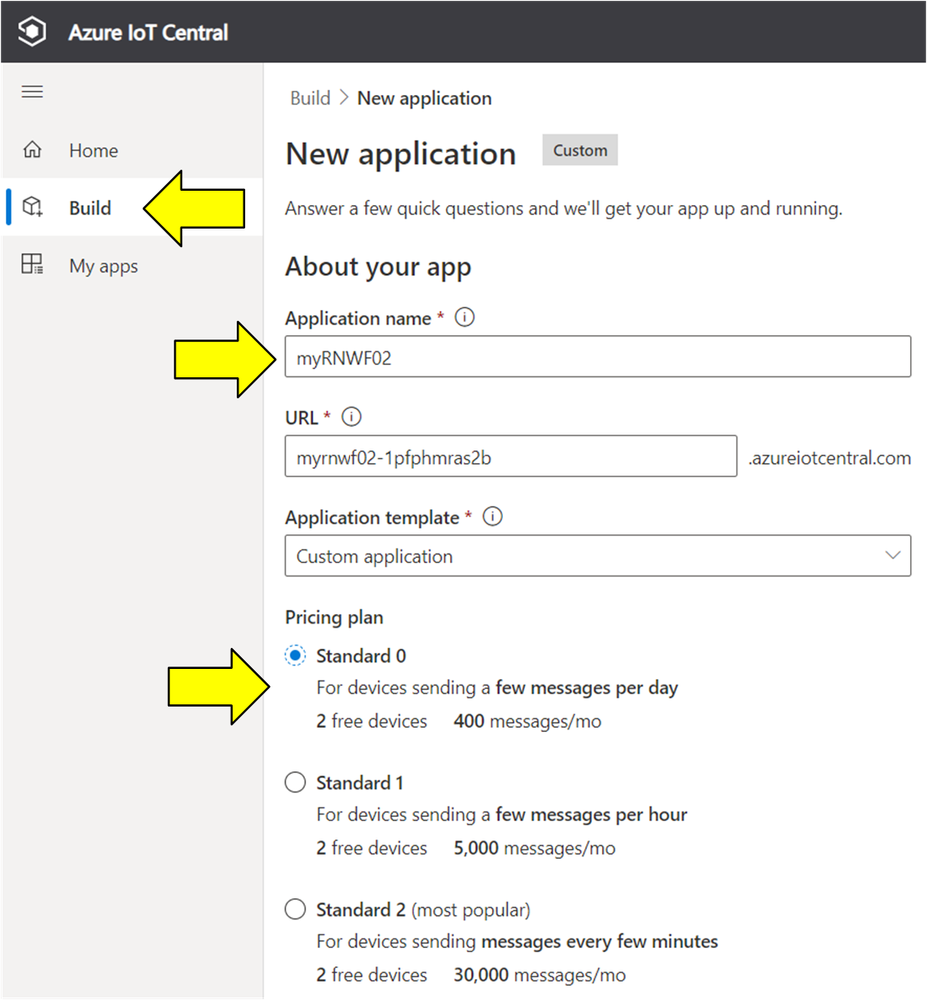
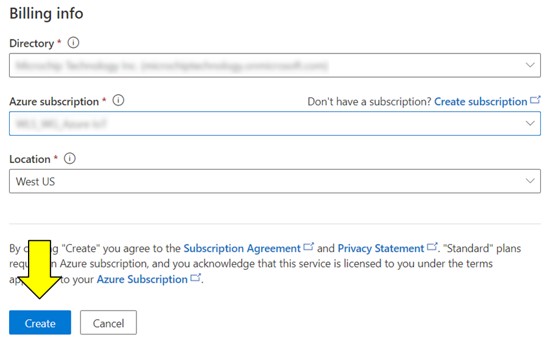
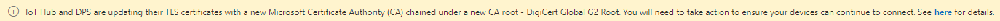

<a href="https://www.microchip.com">
</a>

# Create an IoT Central Application for your Device

Navigate to the Azure [IoT Central Build](https://aka.ms/iotcentral) site, then sign in with the Microsoft personal, work, or school account associated with your Azure subscription. If you are not currently logged into your [Microsoft account](https://account.microsoft.com/account), you will be prompted to sign in with your credentials to proceed. If you do not have an existing Microsoft account, go ahead and create one now by clicking on the `Create one!` link

## Creating An App
After the account setup is complete, its time to build an app that can communicate with the RNWF02PC.

* After your account is setup and working, login in if required and browse to the link below.
  > https://apps.azureiotcentral.com/home
* The web page should look like this...
  * Click on the "Build" menu option on the left.
  
  

  
* In the Custom app pane, click on "Create app"

  

* You will then be prompted to enter app specific information.
  * Choose an _Application Name_.
    * **The "Application Name" should be unique** such as **"RNWF02PC-dev456"**
    * This auto-populates the URL field _"myRNWF02PC.azureIotcentral.com"_
  * Leave the Application template as Custom Application.
  * Set the pricing plan accordingly. Standard 0 is for the "free" plan.

- Choose a unique `Application name` (which will result in a unique `URL`) for accessing your application. Azure IoT Builder will populate a suggested unique `Application name` which can/should be leveraged, resulting in a unique `URL` shown on the screen. Take note of the unique/customizable portion of the `URL` (e.g. "myRNWF02-1pfphmras2b" like shown in the below screen shot).

  

  
  The new URL can be used later as a direct link to your application.

    

* Billing Info
  * Set the _Directory_ and _Azure subscription_ per the drop downs
  * Set the _Location_ to your general location from the selections in the drop down.
  * When complete press the Create button.
 
    

* Azure should now show a screen that looks this. One thing to note is the banner shown at the top in yellow.

>For more than a year Microsoft Azure has been in the process of changing their TLS certificates for the initial connection handshake, from the "Baltimore CyberTrust Root" to the "DigiCert Global G2 Root" certificate.  At the time of this writing, they fully support the new "DigiCert Global G2 Root" certificate as does this demo application so the banner warning can be ignored. 

   

## [Return to the main 'readme'](./readme.md#create-a-new-iot-central-application)