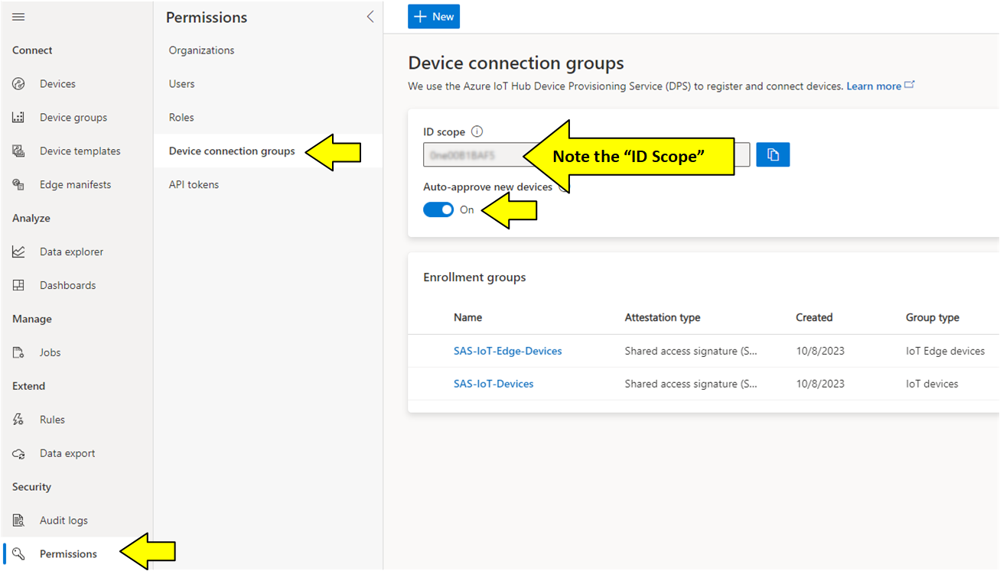
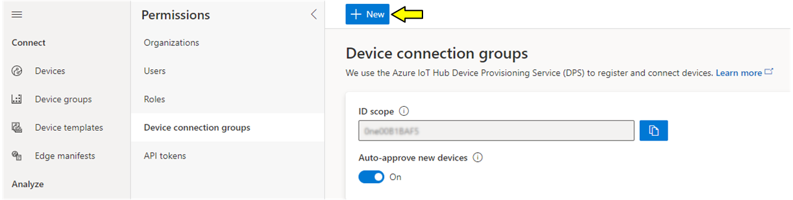
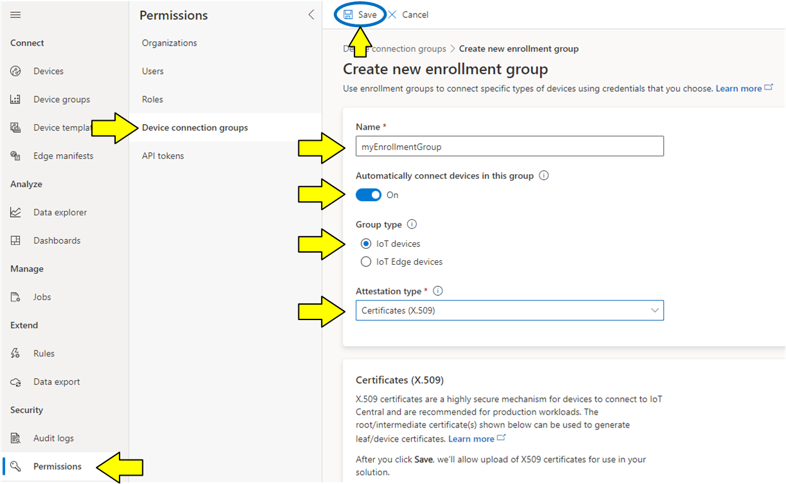
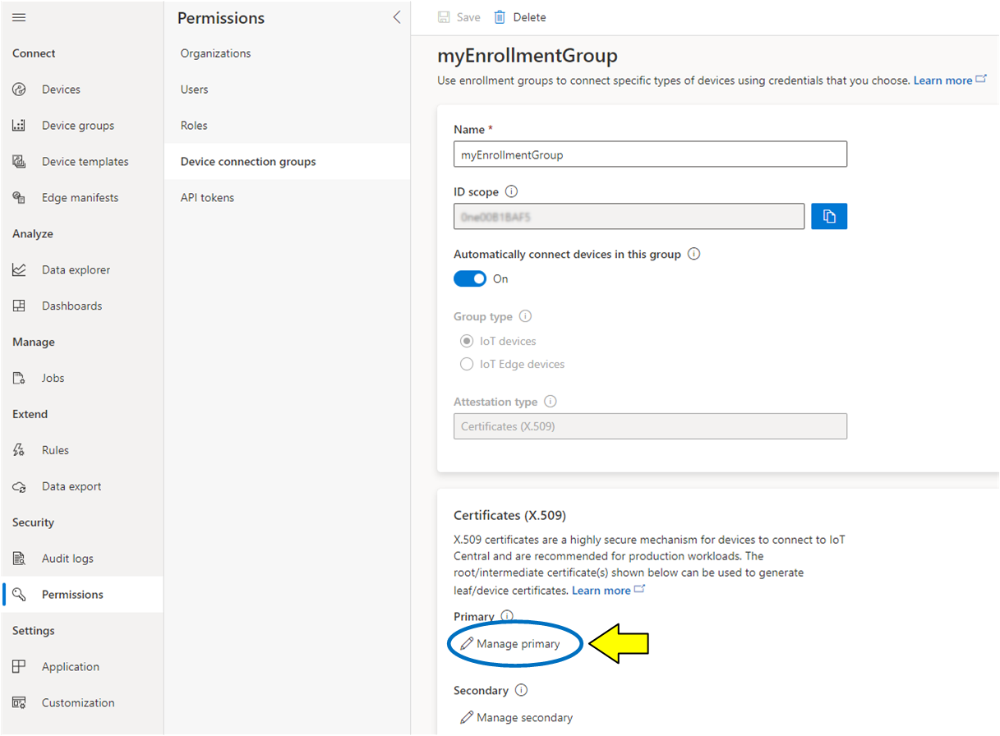
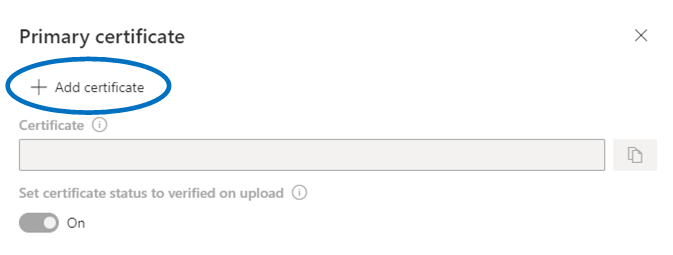
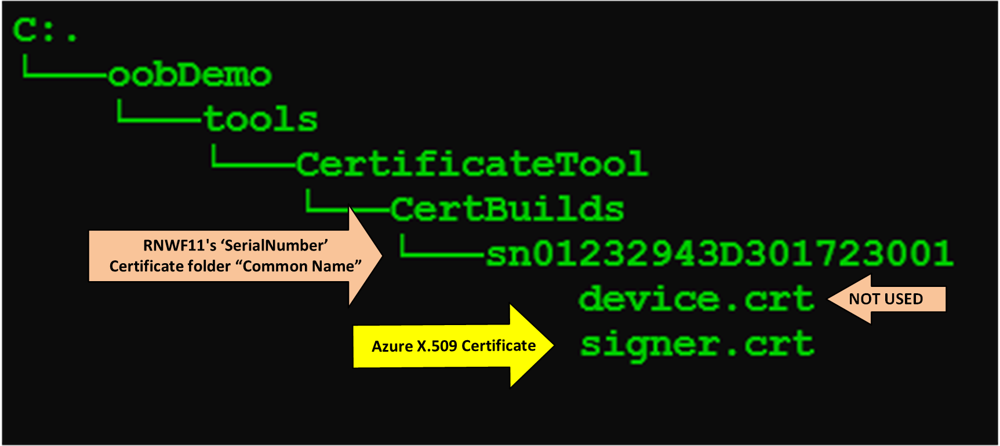
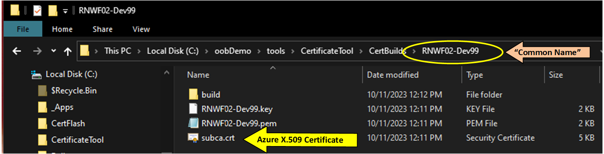
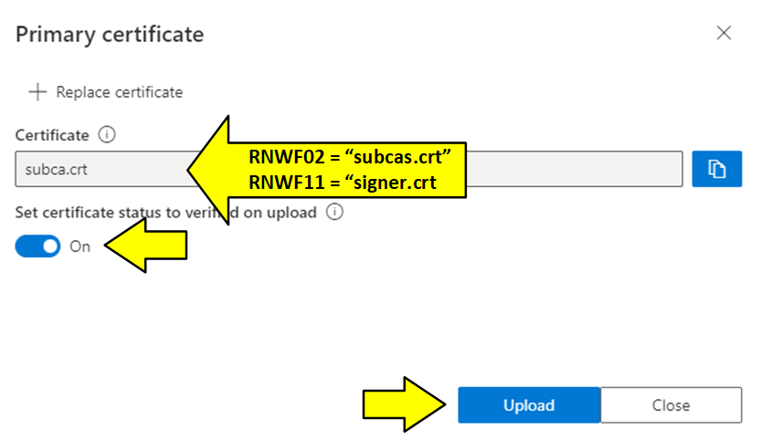
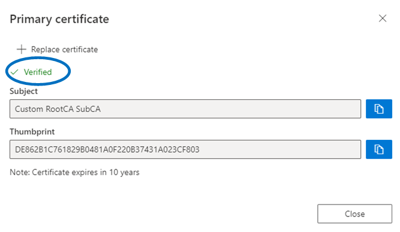
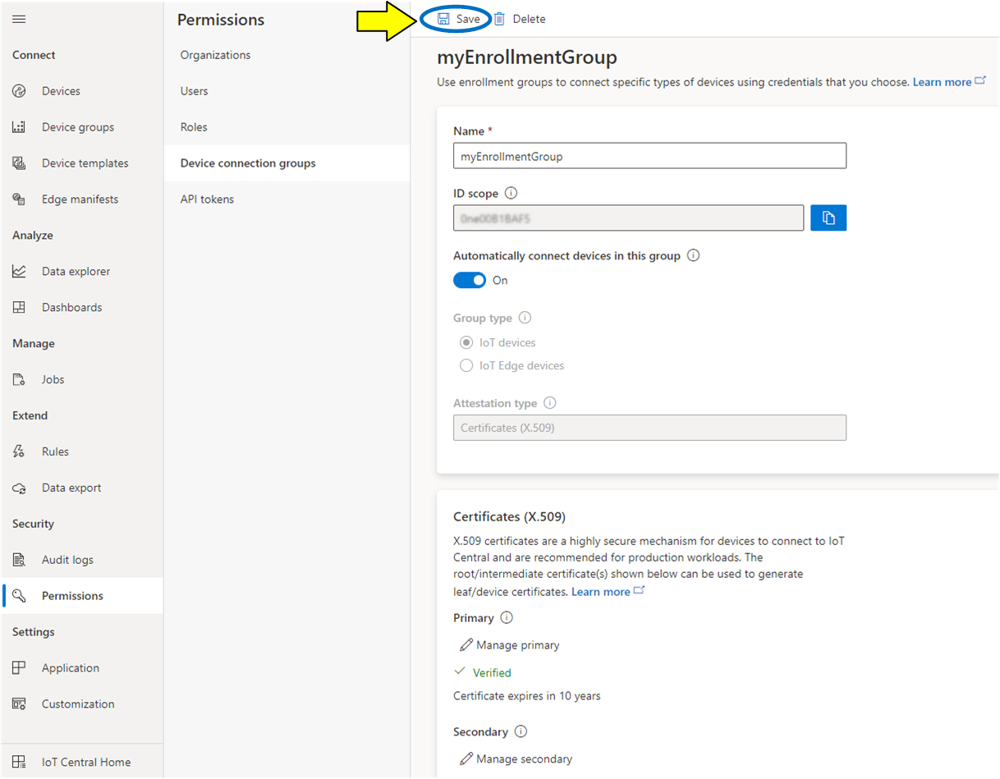

<a href="https://www.microchip.com"><p align="left"></a>

# Setting the Enrollment Group

## Introduction

The _Enrollment Group_ allows you to create a group of allowable devices which each have a leaf certificate derived from a common signer. This demo uses the _Enrollment Group_ to complete a single device enrollment only due to the simplification of the certificate creation process.

To complete the Enrollment Group setup, use the [**Self-Signed Certificates**](./readme.md#create-self-signed-certificates) completed in a previous step.

### Creating an Enrollment Group
This setting will allow your new device to automatically connect in a later step
1. First select the "Permisions" option in the left menu
2. Then select "Device connection groups" to view the "ID Scope" field
   > ## App.cfg Setting
   > _id_scope_ = Value from the "ID Scope" field on this page <br>
   > <br>
    


3. At the top of the pane, press the "+New" button.
   
   

4. In this dialog we will link our device certificate with parent "intermediate" X.509 certificates we created earlier.
   * First choose a name for the new Enrollment Group. The name itself is not important.
   * Make sure the "Automatically connect devices in this group" is set to on as shown.
   * The "Group type" should be set to "IoT devices" as shown.
   * Set the "Attestation type" to _"Certificates (X.509)"_ as shown.
   * When complete press the "Save" button near the top of the screen.
     * In the next step we will upload the actual certificate to Azure.
  
       

5. Uploading the device's X.509 Intermediate Certificate to Azure
   * On the same page, the lower pane should change to show a "Manage Primary" option.
   * "Manage Secondary" is not required and is not set.
   * Click on the "Manage Primary" link

   

   <p align="left">When the "Primary certificate" dialog appears, click on "+ Add certificate" control.</p>
   

6. Use the open file dialog to choose the X.509 certificate file at the path shown below.<br>

    ```text
        "..\RNWFxx_Python_OOB\tools\CertificateTool\CertBuilds\[COMMON_NAME]\rootca.crt"
    ```
   Once selected, press the "Open" button.

   * If you have followed the naming conventions from this demo, the file name should be **"subca.crt"**
  
    |||
    |:-:|:-:|
    |RMWF02|RNWF11|
    |||
    |||

7. To close out the certificate file selection...
   * The file name should be set
   * The "Set certificate status to verified on upload" is on.
   * When ready press the "Upload" button.
  
   

8. If successful the resulting dialog should be similar to this.
   * Press the "Close" button to continue.
  
   

9. Don't forget to **SAVE** the changes with the "Save" button at the top.

   

## [Return to the main 'readme'](./readme.md#setting-the-device-enrollment-group)