<a href="https://www.microchip.com"><p align="left"></a>

# RNWFxx Python Azure OOBDemo (Out of Box Demo)

## Introduction

This document describes how to connect a Microchip RNFWxx to a cloud application running on Microsoft's Azure IoT Central platform. Secure connections are made possible by using Certificate Authority (CA) signed X.509 certificate authentication between the Azure server and client (a.k.a. "device"). Wireless connectivity to the cloud is then established by connecting Microchip's RNFWxx module to a Host PC with an available USB port to serve an easy-to-use, serial-to-cloud bridge using AT commands.

<!-- ### References

* [RNWFxx Application Developer's Guide](./assets/tbd.png) 
* [pyDFU Firmware Flashing Tool](./assets/tbd.png) 
  
#### RNWF02
  * [Wi-FI Module Datasheet](./assets/tbd.png) 
  * [Add On Board User's Guide](./assets/tbd.png) 
  * [AT Command Reference Guide](./assets/tbd.png) 
  * [Firmware](./assets/tbd.png) 
  * [Demo Examples](./assets/tbd.png) 

#### RNFW11
  * [Wi-FI Module Datasheet](./assets/tbd.png) 
  * [Add On Board User's Guide](./assets/tbd.png) 
  * [AT Command Reference Guide](./assets/tbd.png) 
  * [Firmware](./assets/tbd.png) 
  * [Demo Examples](./assets/tbd.png)  -->

## Overview

The demo requires a few basic steps, which includes signing up for a Microsoft Azure account.

### [Software Prerequisites](#software-prerequisites-and-installation)

### [Clone this Repository](#clone-this-repository-1)

### [Hardware Preparation](#hardware-preparation-1)

### [Device Provisioning and Cloud Resources](#device-provisioning-and-cloud-resources-setup)

* [Generate the Files for Your Chain of Trust](#generate-the-files-for-your-chain-of-trust)
* [Create an Azure Account and Subscription](#create-an-azure-account-and-subscription)
* [Setting the Device Enrollment Group](#setting-the-device-enrollment-group)
* [Create an Azure IoT Central Cloud Application](#create-an-azure-account-and-subscription)

### [Running the Demo](#running-the-demo-1)

## Configuration with "app.cfg"
The Python script **"oobDemo.py"** uses an external JSON file to record various parameters. Without getting into too much detail, those required parameters will be highlighted with a document section similar to the one below. When encountering these sections, take note of the specified parameters. When the Python demo is run, it will prompt the user for these parameters.

> ## App.cfg Setting [More Info](#appcfg-settings)
> _STRING_SETTING_ = Setting(s) to remember during _this_ step will be shown here. . .

# Software Prerequisites and Installation

1. [Git](https://git-scm.com/)
2. [Python 3.10.11 or later](https://www.python.org/downloads/). Other versions may work, but have not been tested.

   * Select "Add python.exe to PATH during installation [Recommended]
  
     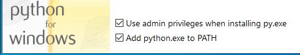
  
   * After installation, open a command prompt in your ```RNWFxx_Python_OOB``` folder
   * Execute the command:
  
    ```
     C:\RNWFxx_Python_OOB\pip install -r requirements.txt
    ```

3. [Terminal Emulator](https://en.wikipedia.org/wiki/List_of_terminal_emulators) program of your choice. 
   * Must support 230,400 baud 
   * Setting the terminal [ENTER] key behavior on transmit to "CR + LF".
   * [Lorris Toolbox](https://tasssadar.github.io/Lorris/)
     * After opening a "terminal" using the **'+'** tab, set the [ENTER] key behavior...
     * [Enter] behavior: Menu->Terminal->Change Settings:<br> Pressing return/enter key sends: "\r\n(DOS)"
   * [Tera Term](https://ttssh2.osdn.jp/index.html.en) 
     * 'Enter' behavior: Menu->Setup-Terminal...<br> New-line, Receive: "CR", Transmit: "CR+LF"
4. Certificate **sendTo_tool** - **RNWF02 Only** Use Windows Explorer's "right click" function to install device certificates to the RNFW02 module.<br>
   ```The RNWF11 module does not require this tool. If accidentally installed, run the 'unistall.cmd' file.```

   * Open a Windows Explorer in the "RNWFxx_Python_OOB\tools\sendTo_tool" folder.
   * Double-click on the "install.cmd" file.
   * When you are done with the demo and no longer need to install certificates, run the ```'uninstall.cmd'``` file.
   * Full instructions are available [here](./tools/sendTo_tool/CertKeyFlashTool.md).
   
# Clone this Repository

Create a clone of this [repository](https://github.com/MicrochipTech/RNWFxx_Python_OOB/tree/main) using the [Git](https://git-scm.com) tool in a command line window

```bash
git clone https://github.com/MicrochipTech/RNWFxx_Python_OOB.git
```

As an alternative, scroll up towards the top of this page, click on the **Code** button, and download a ZIP file of the repository.

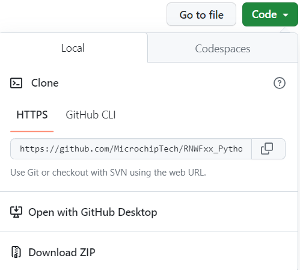


# Hardware Preparation

* Set the power jumper, J201(RNWF02) or J5(RNWF11) to pins 2 & 3. This sets the module to use USB-C power.
* Connect the "RNFWxx" module to a Windows PC with a "USB-C" cable
  
|RNWF02|RNWF11|
|:-:|:-:|
|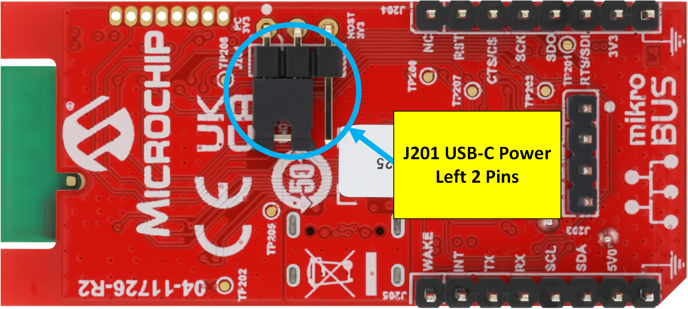|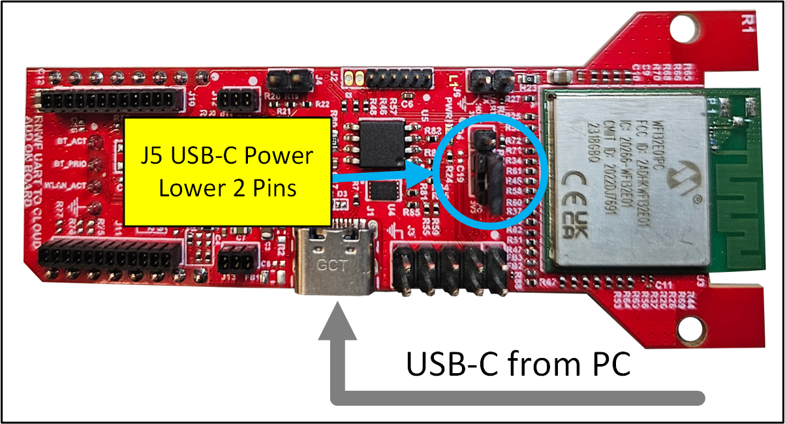|

## RNFWxx Serial Test

  * With the RNFWxx module connected via a USB-C cable, verify the _RED_ LED indicating power is illuminated on the board. Its to the right of the USB-C connector.
  * If the LED is not illuminated, check the USB cable and verify the driver for the UART has been loaded via Windows Device Manager.
* If the new COM port is known, set that in the Terminal program.
  * Configure the port for **230400b,8N1** once enumerated after plugging in the board.
  * Set the [ENTER] key behavior to send "CR + LF" or "\r\n". **The device will NOT respond if this is set improperly.**
* In the terminal press the "Enter" key and verify a response from the module.
* Enter the command ```AT+GMR``` and press [ENTER].
    
    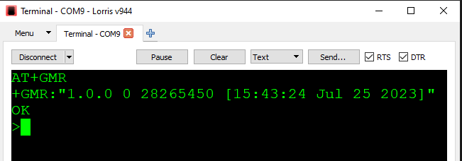
    
    ```The output for the RNWF02 module is shown here, other modules are similar.```


* Keep the terminal open for the [Wi-Fi Test and Security Setting](#wi-fi-test-and-security-setting) section next... 
  

   
### RNFWxx Serial Port Troubleshooting
If the module does not respond there a few things to try. These tips were used with the "Lorris Terminal".
1. Verify the COM port is configured **230400b, 8N1** 
2. Verify the Terminal is set to send "CR + LF" or "\r\n" on transmit. If this is not set, the module will not respond to commands!
3. Disconnect any other USB based UART modules from the PC. Bluetooth UARTs do not need to be disconnected.
4. Unplug the module and then plug it in again. The PC should make a connection sound and show a new COM port in Device Manager. If it does not you may need to install the driver for the UART.
5. Close any other terminals, or programs which may be using the same COM port. This includes the "oobDemo.py" Python script.
6. Make sure the terminal is set to the correct COM port. Fortunately _Lorris_ allows you to open multiple ports at once. Just press the "+" button to open a new COM port tab.
7. Try disconnecting from the module using a software "Disconnect" then "Connect" again. Sometimes this helps to jump start the communication.
8. Disconnect the module, reboot and try again.
9. If all else fails, locate a known good serial device/module, reconfigure it and verify the PC, the terminal and USB cable are working.

## Wi-Fi Test and Security Setting

> ## App.cfg Setting
> _wifi_ssid_ = Set to the desired Wi-Fi devices SSID<br>
> _wifi_passphrase_ = Set the passphrase for the device<br>
> _wifi_security_ = Determined in Step 5 below<br>

While the terminal is open, we will determine the Wi-Fi "security" setting directly from the device. The security setting used by the RNWFxx is represented by a single digit number. Each number represents WPA2, WPA3, etc and must be programmed in a later step. All we need is the SSID and a single command entered in the terminal.

1. With the Terminal open and communication established. 
1. Enter the command ```AT+WSCN=0``` and press [ENTER].
1. After a moment, the available Wi-Fi networks should display.
1. Locate your designated SSID on the right.
1. For example: For the ```"wsn"``` network:
    * **Security Setting is: 3** (Take note of this value for later)
    * Channel is: 6
    * Rx Power: -50dBm
    * MAC Address: 9C:1C:12:96:1D:61

   

The full list of Wi-Fi security settings are available in the RNFWxx's "AT Command Specification" document and listed below.

``` Text
        0   Open
        2   WPA2-Personal Mixed Mode
        3   WPA2-Personal
        4   WPA3-Personal Transition Mode
        5   WPA3-Personal
        6   WPA2-Enterprise Mixed Mode
        7   WPA2-Enterprise
        8   WPA3-Enterprise Transition Mode
        9   WPA3-Enterprise
```

# Device Provisioning and Cloud Resources Setup

## Step 1 - Provision the RNWFxx Module

For secure connections, a chain of trust, which includes certificates & keys for the root, signer, and clients, need to be generated for use with a RNWFxx module. The modules supported by this demo, the RNWF02 and RNWF11

The device (client) certificate file will be needed when we create the Azure IoT Central app and will use the group enrollment method. This method requires uploading a 'signer' certificate file to the Azure IoT Central application. This is required for both RNWF02 and RNWF11.

Any device which presents a leaf certificate that was derived from the signer (or root) certificate, will automatically be granted access to registration (which is governed by the Device Provisioning Service linked to the IoT Hub that's used by an IoT Central application).

> ## App.cfg Setting
> **RNWF02:** These values are set manually by the user<br>
> **RNWF11:** Values are set automatically by the script<br>
> <br>
>  _device_cert_filename_ = Desired "COMMON NAME"<br> 
   _device_key_filename_ = Desired "COMMON_NAME"<br>
   _mqtt_client_id_ = Selected "COMMON NAME"<br>

>
## RNWF11 ONLY: Generate the Files for Your Chain of Trust
The RNWF11 contains internal certificates generated by the factory which are present, but cannot be listed or viewed by the user. These internal "device" certificates must be paired with the corresponding "signer" certificate which must be uploaded to the cloud provider, Azure. The RNWF11 provides an AT+ command, ```"AT+ECCRDCERT=2,1500"```, to download the "signer" certificate to complete the "chain of trust".

Each time the oobDemo script is run, and the module is a RNWF11, the "signer" certificate is requested and written to the CertBuilds folder, **".\tools\CertificateTool\CertBuilds\snXXX...XXX"**. The ```snXXX...XXX``` folder name is unique and based on the factory programmed serial number for this particular module. 

If you are using multiple RNWF11's each one will have its own certificate and therefor its own certificate folder. Care must be take to upload the corresponding "signer" certificate for the particular RNWF11 module you are using. If in doubt, run the script to regenerate the certificate and select the certificate with the latest time stamp displayed in Windows Explorer.

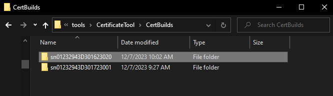


### RNWF11 Certificate Generation
At this point in the process the "app.cfg" file should contain your Wi-Fi settings. If not set, set them using the process described in [Wi-Fi Test and Security Setting](#wi-fi-test-and-security-setting) section.

1. Open a Windows command prompt in the root project directory. Windows Terminal also works well. **C:\\RNWFxx_Python_OOB\\**<br>
   It should contain the file "oobDemo.py"
2. At the command prompt, execute the command:
   ``` text
   .\RNWFxx_Python_OOB\>python oobdemo.py
   ```
3. All required "app.cfg' fields must be set properly, but since we don't have them yet, we will just enter '**none** 4 times'.
4. The script will initially Reset(RST) the module and in about 3s, it will continue.
5. Once the script displays, **Event: WiFi connected...(wait for NTP)**, press the [ESC] key twice to terminate the script.
   * If you wait, the script will exit to the CLI on its own, where a single press of [ESC] will exit instead.
   * Creating the certificates does NOT require a Wi-Fi connection. By the time the connection is attempted the certificates have already been made.
6. That's all that is required for the RNWF11.

| | | |
|:-: |:-: |:-: |
|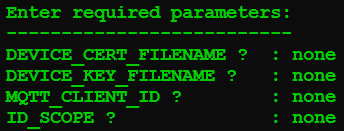|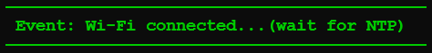 |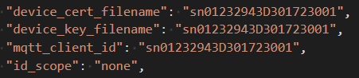 | 
|Enter "none" x 4|Press [ESC][ESC]|New 'app.cfg' Entries<br>Device, Key certs and Client ID automatically set.<br>**ID Scope** will be set in a later step|

#### RNWF11 Optional Certificate Verification
The previous step should have created a new folder containing the RNWF11's certificates. The certificate folder name will use the RNWF11's unique, factory programmed serial number. Its the same string shown in the previous step from the 'app.cfg" file.
1. To locate the new certificates, open Windows Explorer at the root 'oobDemo' repo. 
2. Open the folder **.\RNWFxx_Python_OOB\tools\Certificate Tool\CertBuilds\snXXX...XXX**
3. Verify the 2 files, ```"device.crt"``` and ```"signer.crt"``` are present.
4. In a later step, the ```"signer.crt"``` will be uploaded to Azure. The "device.crt" certificate is not used.

   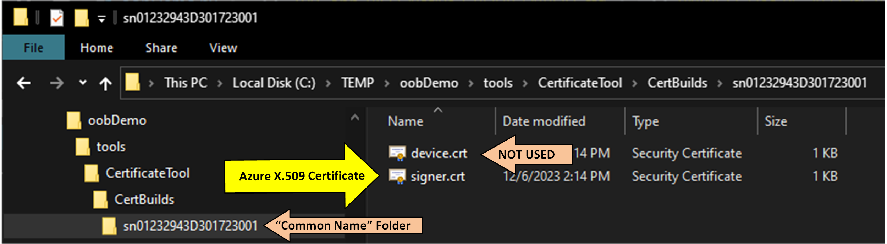

5. Skip to the [Create an Azure Account and Subscription](#create-an-azure-account-and-subscription) step.

## RNWF02 ONLY: Generate the Files for Your Chain of Trust
Creating the required self-signed device certificates is semi-automated and only takes a few seconds. The Windows command script, "auto.cmd", prompts the user for a "common name" and then calls two Bash scripts to complete the certificate creation process. These certificates are used later in the "Python oobDemo.py" step below, so take note of the name you specify in the next procedure.<br>

The scripts used are based on the [Azure's Create and Upload Certificates for Testing](https://learn.microsoft.com/en-us/azure/iot-hub/tutorial-x509-test-certs?tabs=windows) tutorial.

Once these certificates are created, they will be _linked_ to the device Azure creates and cannot be updated without recreating the certificates and reconfiguring Azure.

This simplified process limits the certificate tree to a _single_ device to a _single_ subordinate root certificate. It does not support multiple devices from a single  root certificate.

For this demo follow the instructions shown here:  

### [First Method: "Auto.cmd" for RNWF02](./tools/CertificateTool/readme.md)

## Installing Certificates to the RNWF02 module (Not Required for RNWF11)

**This step is not required for the RNWF11 module as it already contains its own factory generated internal certificates**

We will use the previously installed **sentTo_tool** to flash both the device certificate and device key certificate to the RNWFxx.

* Open a Windows Explorer window and locate the certificate folder from the previous step. It should be something like this:

   ``` Text
   RNWFxx_Python_OOB\tools\CertificateTool\CertBuilds\[YOUR_COMMON_NAME]\
   ```
* From Windows Explorer "right-click" on your device "key" file.<br>
  * eg: ```"RNWF02-Dev99.key"``` because the COMMON_NAME, "RNWF02-Dev99", was chosen during the certificate creation process.
* Then click on the "CERT-KEYFlash" in the menu to upload the "key" file.

  

* Repeat the process for the file "RNWF02-Dev99.pem"

  

* The final certificate, the RootCA "intermediate" certificate for the device, will be uploaded to Azure during the Azure app setup.
  * DO NOT UPLOAD the "intermediate file" ```"subca.crt"``` to the RNWFxx module. It will not work.

## Azure IoT Central Applications

### Create an Azure Account and Subscription

Microsoft has excellent instructions to create an new Azure account and subscription. Please create an account and subscription before continuing. 

Review our overview of the [Azure Account/Subscription creation process](./CreateAzureAccountAndSubscription.md) as required.

### Create an Azure IoT Central Cloud Application

Click [here](CreateAnIoTCentralApplication.md) to create an IoT Central application for use with this demonstration.

NOTE: You can access any of your IoT Central applications in the future by signing into the [IoT Central Portal](https://apps.azureiotcentral.com).

## Setting the Device Enrollment Group

- Access your IoT Central application by signing into the [IoT Central Portal](https://apps.azureiotcentral.com), clicking on `My Apps` in the left-hand side navigation pane, and then clicking on the tile that is labeled with the name of your application.

    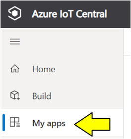

* An _Enrollment Group_ greatly simplifies registering device and is a more practical solution vs. registering each device individually.

    > ## App.cfg Setting
    > _id_scope_ = Will be available when creating an "Enrollment Group"<br>
    > <br>  

* [Enrollment Group](./IoT_CentralGroupEnrollment.md)


**For Your Education**: [Group enrollment](https://learn.microsoft.com/en-us/azure/iot-dps/concepts-service#enrollment-group) allows you to create a group of allowable devices which each have a leaf certificate derived from a common signer or root certificate so that devices do not need to be pre-enrolled on an individual basis. Enrollment groups are used to enroll multiple related devices.

[Individual enrollment](https://learn.microsoft.com/en-us/azure/iot-dps/concepts-service#individual-enrollment) is used to enroll a single device. Feel free to review both methods and be sure to complete the procedure for your preferred method before proceeding with the next step. _Individual enrollment has been omitted in this demo for simplicity._

* A _Device Template_ has been provided with this demo which is set automatically by the script and Azure. No user setup is required. The template defines the demo app's telemetry, parameter and command capabilities.

# Running The Demo

The included python script, "oobDemo.py", is the final step in this process. It consists of 6+1 state machines that execute in order, to establish a secure encrypted TLS connection to the Azure cloud. Data is exchanged bidirectionally. The underlying protocol is based on MQTT v3, or at least Microsoft's version of it.

### Exiting the Demo

The Python script can be exited at any time by pressing the ESC key _twice_. While the script is running, the first press of the ESC key will enter a Command Line Interface(CLI). While in the CLI, a second press of the ESC key will exit the Python script back to the OS.
* If the Python script becomes nonresponsive, use **[CTRL-X]** to exit the Python script.

### oobDemo.py

With the setup complete, the final step is execution of the "oobDemo.py" script. The script will program the RNWFxx module with the required AT+ commands to connect to _your_ Azure account and begin sending and receiving data.

> The script contains numerous error checks and in most cases will fail gracefully with an indication of what went wrong and how to fix it.
> Common Issues:
> * Incorrect Wi-Fi SSID, password or Security setting
> * Devices certificates not uploaded to the device
> * Invalid JSON syntax in the 'app.cfg' file
> * Python module not installed


1. Open a Windows command prompt in the root project directory. Windows Terminal also works well. **C:\\RNWFxx_Python_OOB\\**<br>
   It should contain the file "oobDemo.py"
2. At the command prompt, execute the command:
   ```text
   C:\RNWFxx_Python_OOB\>python oobdemo.py
   ```
3. If the "app.cfg" file was not manually updated during the setup procedure, the user will be prompted to enter each parameter now. If the "app.cfg" was updated you will not see these prompts and the script will execute from here.
    |RNWF02|RNWF11|
    |:-:|:-:|
   |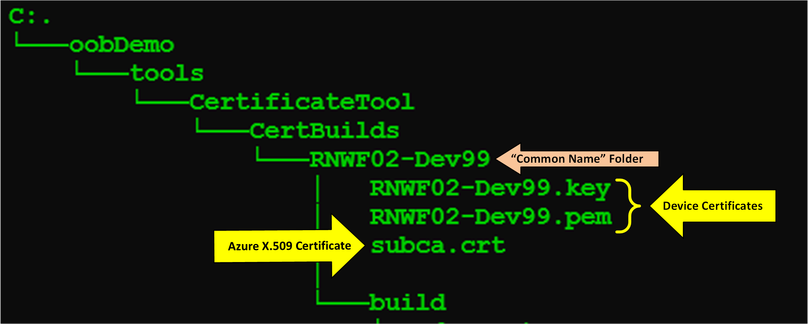|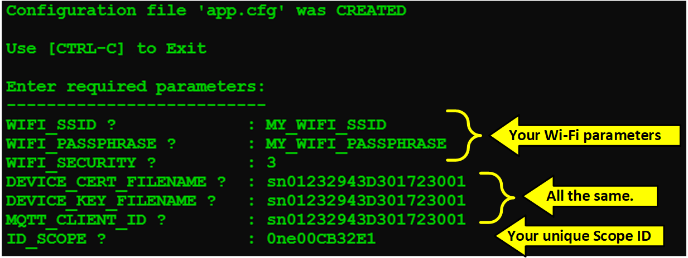|

   * If an incorrect value is entered, Press [CTRL-C] to exit the Python script.
     * Manually edit the 'app.cfg'file with the correction(s) OR
     * Delete the "app.cfg" file, re-run the "oobDemo.py" script and re-enter the values.
   * Re-run the Python script.


## Execution

> ```RNWF02 screen captures are shown below, other modules will be similar...```
> 
Assuming the initial setup is correct, a series of commands should scroll by on the display. If for some reason the script fails to perform the final connection try and re-run the Python script.

   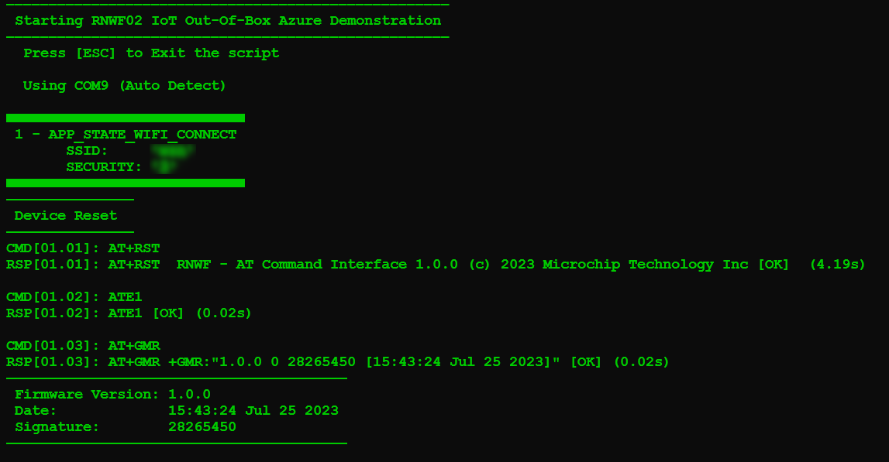

   * If any of the commands fail, the script will show the error message and exit to the app's CLI. The CLI can help with debugging issues like an incorrect Wi-Fi parameter or missing TLS certificate, etc. Short of a script bug, all errors can be corrected by editing the "app.cfg" file, editing your Azure account on the web or recreating your device certificates.

### Interactive Demo 

* When the script completes its execution, the interactive demo itself will be running

   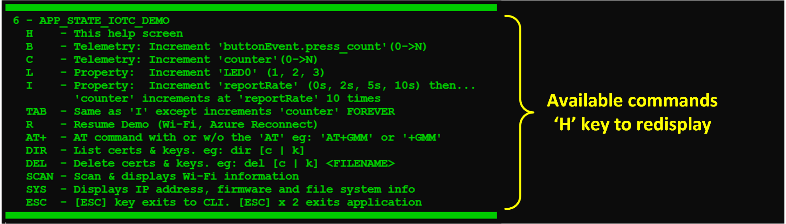

   * If no data has been exchanged with Azure and the device's 60s timeout period expires, the device will disconnect from Azure.
   * If this occurs, the **'R'**(resume) command can be used to reconnect directly into the demo state, without exiting and re-running the entire script. Adjust this value for a longer or shorter period.
     * The default for **"mqtt_keep_alive"** is **60** seconds and can be adjusted in the "app.cfg" file.

    

### Device to Cloud(D>C) Data

* The demo, from the device side (Python Script), limits data sent to Azure to a preset increment or series of values sent using the single button commands shown above. Telemetry and parameter values are supported. With each press of a command button, 'B', 'C' and 'L', the script will send an incremented "buttonEvent" (1, 2 or 3), "counter" (0 to X) or "LED0" (1,2 or 3) to Azure. "LED0" is not shown here.
  
   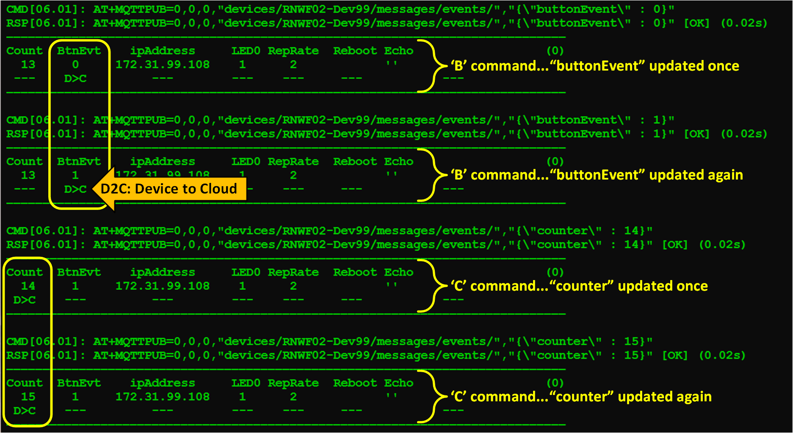

* The command button "I" increments the "counter" value, waits for a "reportRate" value in seconds and repeats this 10 times. Each time the "I" command is used, the "reportRate" cycle through the series of values in seconds 0, 2, 5 & 10 then back to 0.
  
   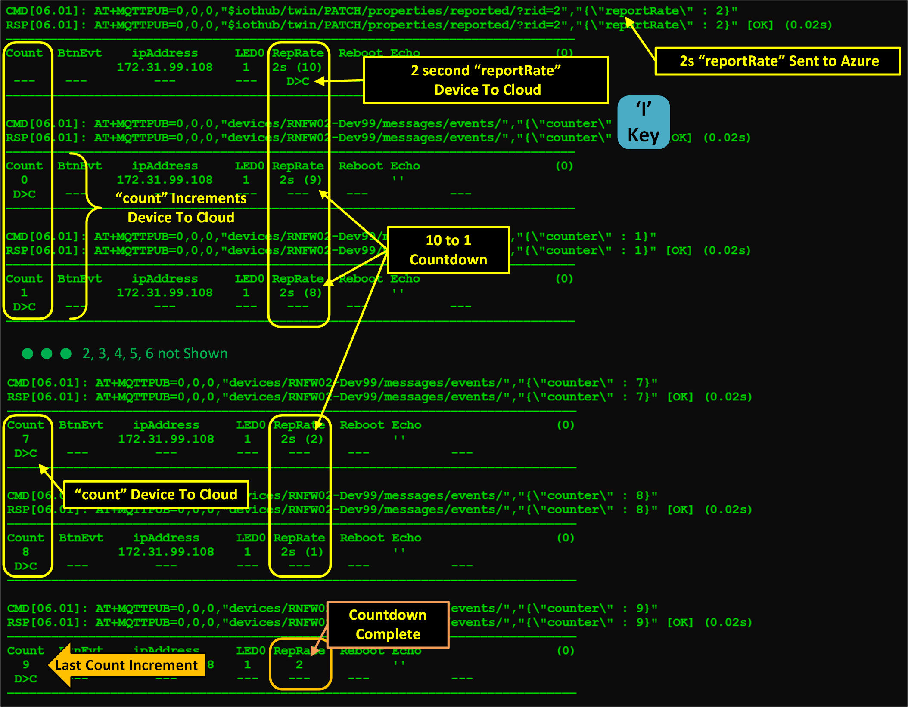

### Cloud to Device(C>D) Commands (Reboot Delay and Message)

Two commands are defined in the provided template. Under the "Commands" tab there is a "Reboot Delay" and a "Message" command. Note "commands" such as this cannot be added to a user created "dashboard"

**"Reboot Delay"**, when sent from Azure, will instruct the RNWFxx to completely reboot after a specified time period. That period can be in seconds, minutes or hours. The command must follow the syntax shown below. 

* Syntax: PT#?, where '#" is the value for seconds, minutes or hours and '?' must be "S", "M" or "H"
  * Examples:
    * PT5S - Reboot in 5 seconds
    * PT1M - Reboot in 1 minute
    * PT1H - Reboot in 1 hour
    * PT0S, PT0M or PT0H - Cancels a reboot request
  
    A reset command can be cancelled by sending the command with "0" delay. _Note: When a reboot has been cancelled, the script, by design, returns a failure status to Azure._ This is not an actual failure and only demonstrates how a failure status can be sent back to the cloud.   

**"Message"**, sends a text message from the cloud to the device. That decoded message will be displayed on the Demo screen. Long messages are truncated by the script to keep the CLI display uniform.
   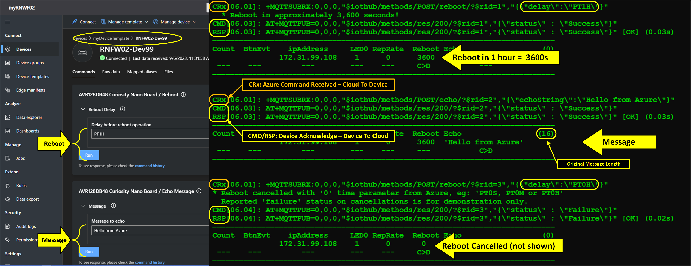

Commands from the cloud to the device MUST be acknowledged by the device back to the cloud upon receipt. If they are not acknowledged within a few seconds, Azure assumes the command failed. The CLI indicates a command was received with the line item **"_CRx_"** instead of the normal **"_CMD_"**.

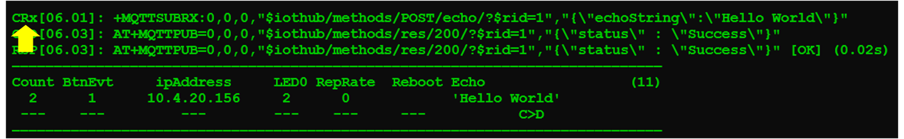
<br>

#### Cloud-2-Device Success or Failure

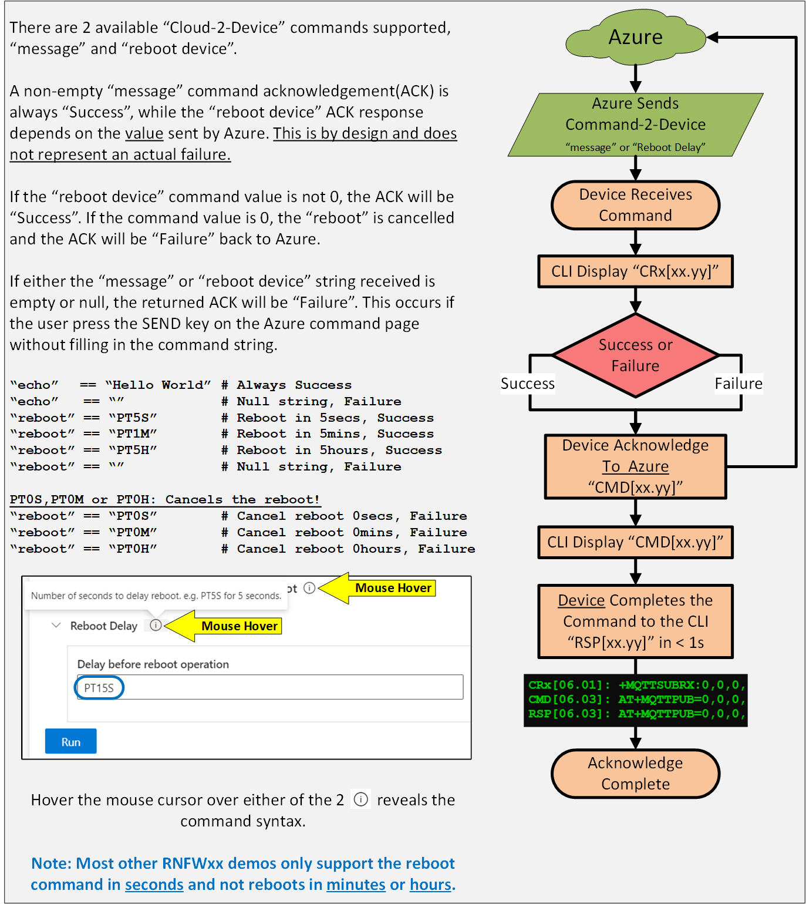

#### Cloud-2-Device Success or Failure Command Syntax
```
CMD[06.03]: AT+MQTTPUB=0,0,0,"$iothub/methods/res/200/?$rid=1","{\"status\" : \"Success\"}"
CMD[06.04]: AT+MQTTPUB=0,0,0,"$iothub/methods/res/200/?$rid=1","{\"status\" : \"Failure\"}"
```

#### Azure Raw Data View

Azure displays all data sent to and from the device in the "Raw data" table. It is not updated in real time, but you have the option of waiting for the update or using the "refresh" button in the upper right corner or a "F5" browser refresh. Note the columns are usually too wide to show everything without scrolling right or changing the column widths.

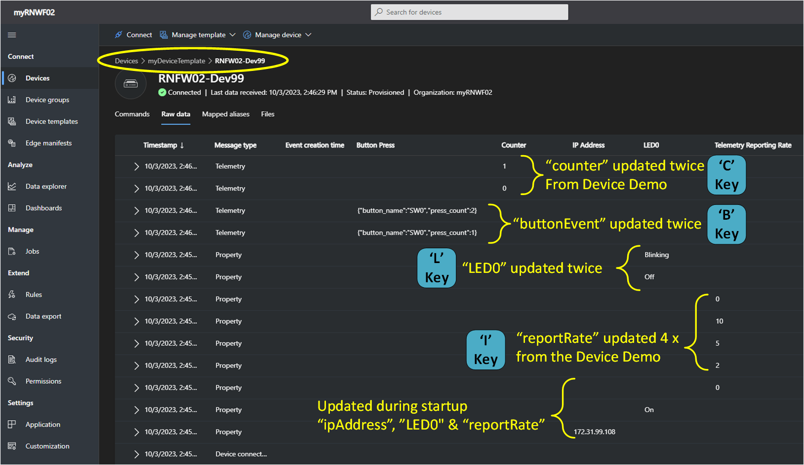

## Azure Dashboard

A simple dashboard for this demo is displayed below. Unfortunately dashboards must be created by the end user as they cannot be exported nor imported. Pressing the Dashboard button on the left takes the user into an online wizard to get started.

  1. Select the "Dashboards" button under the "Analyze" category on the left.
  2. At the top of the interface press, the "Edit" button.
  3. Your new dashboard comes pre-populated with items you don't need.
     * For each block, click on the "..." button and choose "Delete".
  4. From the "Start with a visual" option on the left, select and drag controls from the left column and drop them on the dashboard.
     * The _command control_ is available under the "Start with devices" option on the left.
  5. Use the "pencil" button to configure your new dashboard objects.
  6. Don't forget to save your work.
   
|Start...|Finish...|
|:-:|:-:|
|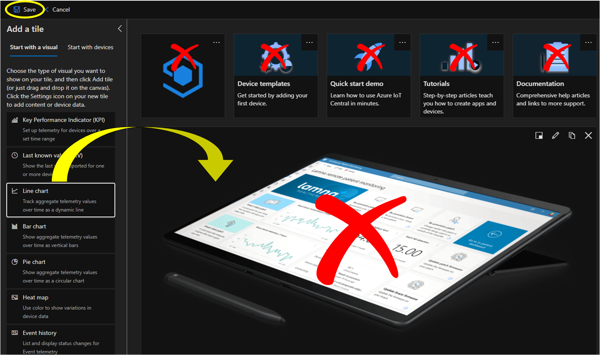|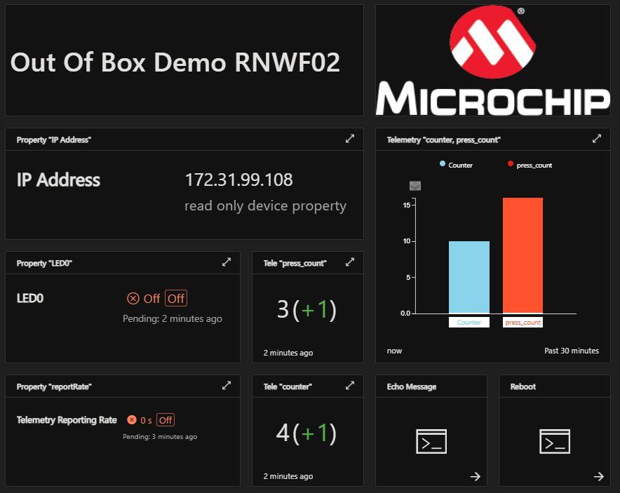|

   
# How the "oobDemo.py" Works

## Execution Overview

The script sends "AT" commands to the RNFWxx module one at a time, waiting for a response "RSP" back from the module or web service. The script will not proceed until it receives a response. If no response is received within the default or programmed timeout period, the script will fail the command and exit to the CLI. Most commands use the original command text as its response text to wait for. These commands are typically Wi-Fi or MQTT programming commands sent to the module and return in less than a second.

Other commands such as the connect to Wi-Fi command, ```AT+WSTA=1```, may take 20s or more for the connection. This command is programmed to wait until it receives a "+TIME" response from the programmed ```Network Time Protocol``` server. Once received, the command is completed and the next AT command processed.

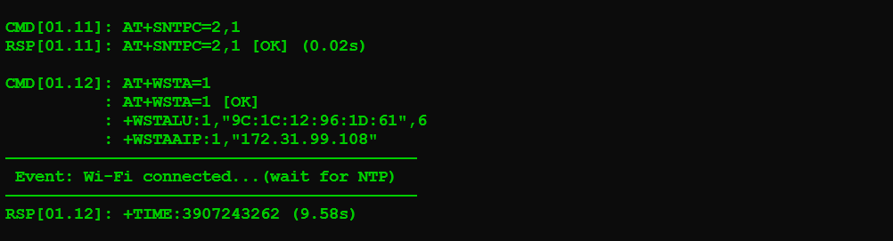

   ```
   CMD[01.11]: AT+SNTPC=2,1                     <- Command sent
   RSP[01.11]: AT+SNTPC=2,1 [OK] (0.02s)        <- Solicited response returned & command was COMPLETED.
   
   CMD[01.12]: AT+WSTA=1                        <- Next Command sent
           : AT+WSTA=1 [OK]                     <
           : +WSTALU:1,"9C:1C:12:96:1D:61",6    <- Unsolicited responses returned so keep WAITING...
           : +WSTAAIP:1,"172.31.99.108"         <
   ──────────────────────────────────────────
   Event: Wi-Fi connected...(wait for NTP)
   ──────────────────────────────────────────
   RSP[01.12]: +TIME:3907243262 (9.58s)         <- Solicited response received & command was COMPLETED.
   ```

* The first command, ```AT+SNTPC``` is a setup command and completes in less than a second with a module response string of ```AT+SNTPC```.
  
  * This command completed almost immediately because its a setup command for the RNFWxx module which can immediately respond.
  
* The second command, ```AT+WSTA=1```, connects to a Wi-Fi access point and is set to wait until it receives the correct time from the requested NTP server.

  * The command is programmed to wait for a ```+TIME``` response string.
  
* The command completed after the ```+TIME``` response was returned.
  
* The "Unsolicited Response" Strings
  
  * While the ```AT+SNTPC``` command was processing, several strings were returned by the module, but did not match the string we were waiting for. These responses were "unsolicited".
  
    * If a string is returned by the module that does not match the "wait" string, it is displayed without the ```RSP[XX:YY]``` prefix, then indented with a ":" and followed with the unsolicited response string.
  
    * The line display is for informational purposes and indicates the command is still processing and waiting for the correct response to be returned.
  
    * Once that response is received, the standard ```RSP[XX:YY]: Some String``` is displayed and the next AT command is processed.
  
### State and Sub-States

* Each command and response line item indicate the current execution State and SubState in the square brackets shown. i.e. **CMD[01:12]** and **RSP[01:12]**
  
* Every command must have a matching response, with the same **state:sub-state** values. If not, the command will timeout and the script will terminate with an error to the CLI.

## State Machine

There are 6+1 state machine "states" that run from state 1 to 6. States 1 through 5 perform increasingly important tasks from Wi-Fi settings, Azure DPS, MQTT and finally the Demo itself in state 6.

State 0 represents a pseudo state, the +1 state (0). It is the Command Line Interface(CLI) and can be used for debug or sending AT+ commands to the RNWFxx module.

Entering the zero state can be done any time after the initial RNWFxx reset has completed by pressing the "ESC" one time. While in the zero state, a second press of the "ESC" exits the script to the OS. Sometimes an "ESC" results in a loss of communication with the RNWFxx. _If this occurs, use "CTRL-C" to terminate the script and retry._

### State Machine Generalities

States 1 though 5 all perform in a similar manner. Each sub-state within a state, sends an AT command and waits until the proper response string is received before moving on to the next AT command.

* Substate 0 of every state is where the state "banner" is displayed, unless disabled by the "app.cfg" setting ```display_level``` is set to '0'.

* Substates 1 though n-1 send setup AT+ commands to perform the required task of particular state.

* Substate 'n', or the final sub-state sends the final AT+ command to initiate the state's ultimate task such as connecting to Wi-Fi or performing Azure's DPS.

  * When the final AT+ command is executed it usually takes much more time than the previous setup commands.

  * If the final AT+ command fails, it's usually caused by one or more of the previous setup commands for that state. This is because the RNWFxx checks each command and accepts it based syntax, not context. The module does not know what the ultimate task is until the final command. Once this occurs, the final command will fail if any of the previous setup commands were invalid.

    * A good example of this is a Wi-Fi connection. If the password is incorrectly set in sub-state 7, the module accepts the password based on syntax alone.

      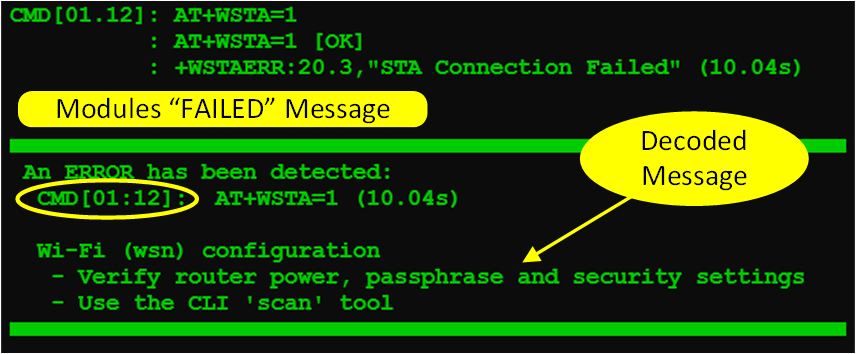

    * When the AP connection is attempted at sub-state 12, it will fail due to the invalid password. Sub-state 12 failed, but the actual failure is at sub-state 7 where the wrong password was set.

|State|SubStates|Name|Purpose|
|:------|:--:|:-----------:|:---------|
|0|0-2|Command Line(CLI) State|Interactive state for AT+ command execution + internal commands|
|1|0-22|APP_STATE_WIFI_CONNECT|Setup Wi-Fi registers and connect to the Internet|
|2|0-17|APP_STATE_MQTT_SETTINGS|Setup MQTT registers to Register & connect with Azure|
|3|0-9|APP_STATE_DPS_REGISTER|Setup MQTT registers for data exchange with Azure using DPS|
|4|0-4|APP_STATE_IOTC_CONNECT|Registers and 'Device Twin' connections|
|5|0-7|APP_STATE_IOTC_GET_SET_DEV_TWIN|Get and sets Azure 'Device Twin' values. Values for "LED0", "reportRate", "press_count" and counter are set and synchronized between the device and the cloud in this state|
|6|0-5|APP_STATE_IOTC_DEMO|Interactive demo with Azure cloud to send and receive data|

## CLI Commands (State 0)

The CLI can be executed any time after the initial script "reset" command or about 4 seconds after the Python script starts.

The CLI state will be entered anytime the user presses **[ESC]** one time during script execution. The CLI state is automatically entered if an error is reported back from the RNWFxx or the Azure cloud. If CLI entry was caused by an error, the command and response, displayed just prior to the error, should be reviewed. Some errors are decoded and provided on the display showing the likely cause and solution.

If the user needs access to the CLI before completing demo steps, they will likely be prompted for parameters they do not have yet. This includes Wi-Fi parameters. To get around this, enter something like "junk" at each prompt, and  number such as '3' at the Wi-Fi security prompt (it has to be number).

**Note: If junk was entered into the config file, make sure you manually edit and remove the junk info, or delete the "app.cfg" file all together. It will be recreated on the next Demo run where you can enter the correct information again.**

Eventually the script will start to execute and commands will start scrolling. Once this happens, press the **[ESC]** one time, and you should get a display like this:

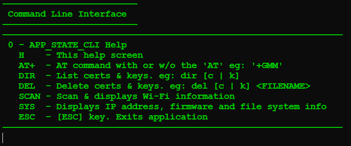

At the prompt you can run any of the displayed commands. The table below explains the available command syntax. Feel free to experiment with the "DIR", "SCAN" and "SYS" commands. They are informative commands and will not make any lasting changes to the RNFWxx module. The one command that can and will change the module is the "DEL" commands and is discussed below.

|CLI Command|Parameters|Syntax|Description|
|:-----:|:--:|:-----------:|:---------|
|HELP|0|help|Displays CLI help|
|AT+|-|AT+XXX=yyy|Any module supported AT+ command with or without "AT+".<br>Capitalization matters with AT+ commands<br>example: **AT+WSTA=1 or +WSTA=1 are equivalent**|
|DIR|2|dir [c\|k]|Lists certificates or keys stored in the RNWFxx<br>example: **list c**|
|DEL|3|del [c\|k] filename|Deletes certificates or keys stored in the RNWFxx<br>example: **del k myCertificateKey**|
|SCAN|0|scan|Passively scans & displays available Wi-Fi routers/access points|
|SYS|0|sys|Displays network, firmware and files system information|
|ESC|0|Press 'ESC' key|Exits the script to the OS|

### Listing Certificates and Keys on the RNWFxx module

Once the CLI has been entered you can use the _DIR_ CLI command to list the installed certificates and keys.

1. Use the CLI command "dir c" or "dir k".
2. You should see a display like this:

> ```RNWF02 screen captures are shown, other modules will be similar...```
  
|**List Certificate Keys (dir k)**|**List Certificates (dir c)**|
|:-----:|:-----------:|
|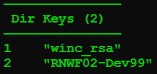|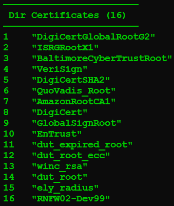|

### Deleting Certificates and Keys from the RNWFxx module

Once the CLI has been entered you can use the _DEL_ and _DIR_ CLI commands to delete and list the certificates and keys respectively.

1. First list the installed certificate or certificate keys as shown above in [Listing Certificates and Keys on the RNWFxx module](#listing-certificates-and-keys-on-the-RNWFxx-module)
2. If deleting a key enter, the command "del k [FILENAME]" and press enter. eg: "del k RNWF02-Dev99"
   * For the [FILENAME], capitalization matters. eg: "del k rnwf02-dev99" will not work.
3. If the delete was successful you should receive a message similar to the ones shown below.
   
4. You can double check by re-displaying the list with the "dir c" or "dir k" commands. The certificate or key should no longer display.

|**Delete Certificate Keys (del k XXX)**|**Delete Certificates (del c XXX)**|
|:-----:|:-----------:|
|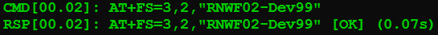|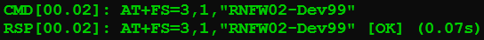|

### Warning

All the keys and certificates displayed can be deleted using the "del" command described. Space on the module is limited and for some users, deleting some or all of the pre-installed certificates may be required. Note that once a built-in certificate has been deleted it can only be restored by re-flashing the firmware.

* **If the "DigiCertGlobalRootG2" certificate is deleted, this Demo will NOT work until it is restored with a the firmware reflash operation.**

## App.cfg

The "app.cfg" file contains all the settings required for the Python script to connect to the Azure cloud. No modification to the underlying Python script should be required. If the "app.cfg" file does not exist when the script is run, a default version will be created and the user will be prompted for any missing parameters. The 4 parameters, "operation_id", "assigned_hub", and "display_level" will not prompt the user for values because they are automatically determined at run-time.

The "app.cfg" file is formatted in JSON, and can be modified by the user if desired, such as during the steps in this demo. When the JSON file is read by the Python script, it is checked for proper syntax. If any syntax errors are found, the script will indicate the probable fault and line number in the "app.cfg" file and exit.

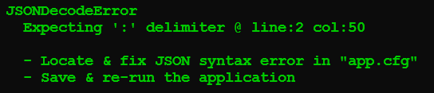

The config file name, "app.cfg" is hard coded in the Python script. If the user needs to preserve a particular configuration, make a copy of the the config file and create a new one with different parameters.

### General "app.cfg" JSON Rules

* All parameters and values are strings and MUST be surrounded by **quotes**. i.e. **"130"**
* All parameter, value pairs in the JSON file MUST end in a **comma** EXCEPT for the last line.
* Parameter and value pairs MUST be separated by a **colon**, i.e. **"wifi_ssid": "MySSID",**

### Create an Empty/Default 'app.cfg' file

* If you already have an 'app.cfg' and just want to create a new one from scratch, delete 'app.cfg' then...
* If you have an 'app.cfg' file and want to keep it for reference, rename the file to something like 'app1.cfg' then...
* Run the command **python oobDemo.py** as shown below
* At the first prompt, press [CTRL-C] to exit the script. A new default 'app.cfg' file will be in the same folder as the script.

  ```
  C:\oobdemo\python oobDemo.py 
  
    Configuration file 'app.cfg' was CREATED
    
      Use [CTRL-C] to Exit
    
      Enter required parameters:
      --------------------------
      WIFI_SSID ?             :
    
      [CTRL-C] User Exit
  ```

### COM Port Setting Auto-Detection

The connected RNWFxx device is automatically detected at the start of the Python script. There is no manual override. Refer to "Check These First" section below for troubleshooting steps.

**Check These First**

1. Do you have a terminal open on the same port? Disconnect the terminal and try again.
2. Disconnect any additional modules or USB-to-UART adapters connected to the PC.
3. Is the terminal configured for the correct __ENTER__ behavior set as "\r\n" (Carriage Return + Newline)?
   * The device will not respond if this setting is not correct.
   * Refer [here](#software-prerequisites-and-installation) then __Terminal Emulation__.
4. Device has power and the red LED on the board displays brightly/
5. The OS shows the COM port in the Device Manager when plugged in which disappears when unplugged.
6. From a terminal configured as 230400b 8N1; Press the [ENTER] key.
   * If you get a response such as ```ERROR:0.2,"Invalid AT Command"``` the device is communicating properly.
     * Double check with the command ```AT+GMM```. You should receive a part number in the terminal.


### Working with a Single App.cfg file

The configuration file is quite flexible in its syntax as long as it remains in pure JSON format, i.e. no missing comma's or quotes.

When the config file is read, each parameter is checked against a list of supported variables.

* The file is read from beginning to end.
* As each line is read, if the variable is recognized, it is stored and the next line is read.
* If the variable is NOT recognized it is ignored; however the syntax is checked and will fail if the JSON format is invalid.
  * Make sure there is a value for the parameter so that your are not prompted for it; e.g. ```"MyCustomVariable": "_",```
* If multiple variables of the same name are encountered, each are read, but only the <ins>last one</ins> is stored and used by the Python script.

#### APP.CFG 'comments'

JSON unfortunately does not support comments, however the Python script will ignore any "unknown" strings it encounters. This functionality allows for user comments. Any line added to the file, that is not recognized as a valid parameters will be ignored.

To prevent being prompted for a value, make sure each "comment" parameter has at least a single character "value" such as an underscore '_'. White space will not work.

```
{
    "THIS IS A COMMENT AND THE SCRIPT WON'T CARE": "_",
    "wifi_ssid": "",
. . .
}
```

#### APP.CFG Multiple Values of the Same Name

The same variable name can be listed in the file multiple times. This allows a single config file to support multiple Wi-Fi networks. To change the network the user just has to move the desired variable to be the last ones read in the config file.
```
{
    "wifi_ssid": "MY_WORK_SSID",          <- This SSID will NOT be used because of the second copy below
    "wifi_passphrase": "workPassPhrase",  <- This PASSPHRASE will NOT be used either

    "wifi_ssid": "HOME_SSID",             <- These parameters will be read and used because they were the
    "wifi_passphrase": "homePassPhrase",  <- ones read by the script

    "wifi_security": "",                  <- This security setting will be read and used by either SSID
    . . .
}
```

> ## App.cfg Settings
> * wifi_ssid = ???<br>
> * wifi_passphrase = ????<br>
> * wifi_security = ???<br>
> * device_cert_filename = device_key_filename = mqtt_client_id = ???<br>
> * id_scope ??? <br>

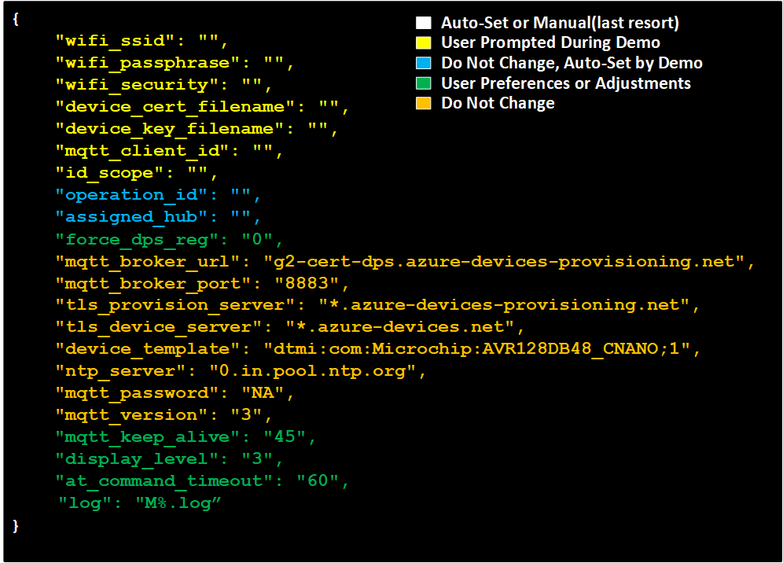

### _App.cfg_ - User Prompted During Demo (YELLOW)

The table below shows the 5 parameters needed to connect the RNWFxx to an Azure cloud account. This does not include the COM port which should auto detect and 2 Azure DPS registration settings which are handled during Azure's DPS process.

|App.cfg "field"|Source Azure/Script/User|Setup Step|Description|
|:--|:--:|:--:|:--|
|"wifi_ssid"|User|Wi-Fi Test and Security Setting|Wi-Fi BSID|
|"wifi_passphrase"|User|Wi-Fi Test and Security Setting|Wi-Fi passphrase|
|"wifi_security"|User|Wi-Fi Test and Security Setting|Can use the CLI command 'scan' for this info|
|"device_cert_filename"|User|Create Self-Signed Certificates|Self-Signed Certificate 'Common Name'|
|"device_key_filename"|User|Create Self-Signed Certificates|Self-Signed Certificate 'Common Name'|
|"mqtt_client_id"|User|Create Self-Signed Certificates|Self-Signed Certificate 'Common Name'|
|"id_scope"|Azure|Setting the Device connection groups|User copies unique string from Azure|


### _App.cfg_ - Do Not Change, Auto-Set by Demo (BLUE)

After a user has setup their Azure application, the DPS process commands returns the values for the "operation_id" and "assigned_id" and the script automatically sets them in the "app.cfg" file. If the user desires to re-DPS, setting both of these to an empty string will cause DPS to run again at least once regardless of "force_dps_reg" setting.

Only the RNWF02 utilizes these "app.cfg" fields and the script sets them automatically. They are used to record the 2 key strings needed to communicate with Azure. The RNWF11 also requires these strings, but the RNWF11 module itself negotiates with Azure and stores them internally.

```If set with a RNWF11, the settings will override the internal version and cause an DPS failure with Azure.```

|App.cfg "field"|Source Azure/Script/User|Setup Step|Description|
|:--|:--:|:--:|:--|
|"operation_id"|Azure|DPS Registration|**RNFW02:** Auto Set by Python script. DO NOT MANUALLY SET<br>**RNFW11:** Not used. MUST remain empty ```""```.|
|"assigned_hub"|Azure|DPS Registration|**RNFW02:** Auto Set by Python script. DO NOT MANUALLY SET<br>**RNFW11:** Not used. MUST remain empty ```""```.|

### _App.cfg_ - User Preferences or Adjustments (GREEN)

|App.cfg "field"|Default|Description|
|:--|:--:|:--|
|"force_dps_reg"| "0"|**RNWF11 Users should NOT enable this setting and leave the default of '0'.**<br>Setting this value to '1' will force a DPS negotiation on every execution. Technically, once DPS is successful, it does not need to be performed again.<br>Not performing DPS saves about 20s during the run before the user gets to the Demo state. <br>Setting this to '1' re-writes the values for **"operation_id"** and **"assigned_hub"** in 'app.cfg' for every execution.|
|mqtt_keep_alive |"120"|Value in seconds before the module will disconnect from Azure without data activity. Increase this value, if the module disconnects due to inactivity. |
|"at_command_timeout"|"45"|Value in seconds before the script times out an "AT+" command. If a response is not received within this period, the script exits with a time-out error to the CLI. If on a slow internet connection, increasing this value may prevent premature time-out errors. This is only the default time-out period. Some commands are hard coded to longer or shorter periods.|
|display_level|"3"|This controls the amount of information displayed on the screen during script execution. The range is 0 to 4, with 0 being less and 4 the most info displayed. Each level will show its specified data and that of a lower "display_level" value.<br>**0: Extra displays off...Only CMD and RSP displayed<br>1: Displays State transition banners<br>2: Display info and events & lower<br>3: Display 'Demo' IOTC data & lower [default]<br>4: Display Decodes such as JSON, Crx and lower**<br><br>```RNWF02 screen captures are shown, other modules will be similar...```<br>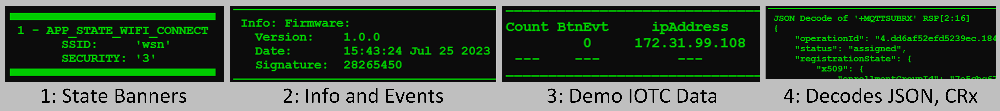|
|log|"%M.log"|This option automatically produces an AT command log file. Default logs are created in the ".\logs" folder relative to the script directory. The default log file name used will be the name of the device; e.g. "RNWF02.log" or "RNWF11.log" and each execution will overwrite the previous one. To customize log creation refer to the next section.|

#### Log Files
The "log" option in the 'app.cfg' file allows the user to specify the log file name and its output path relative to the execution directory. The log definition string's default is "%M.log" which uses one of 3 supported substitution tokens described below.

1. **%M or %m**: These tokens are replaced by the 'Device Model' number; e.g. "RNWF02" or "RNWF11"
2. **%D or %d**: The date token is replaced by the date in the form "MMM_DD_YYYY"; e.g. "Dec_01_2023
3. **%T or %t**: The last token supports time in the form "HH-MM-SS"; e.g. "13-01-59". Hours are in military or 24H time.

   e.g. ```"My_%M_%D_@_%T.log"``` could create a log file named...<br>
   ```"My_RNWF02_Dec_01_2023_@_13-01-59.log"``` with a RNWF02 module or ...<br>
   ```"My_RNWF11_Dec_01_2023_@_13-01-59.log"``` with a RNWF11 module

##### Notes

* The default log definition, "%M.log", will be overwritten on each execution of the same device type; e.g. "RNWF02.log" or "RNWF11.log". Each device type will create its own log.
* The default "log" path, relative to the execution directory, is hard coded to the script folder as "\logs". The script path definition variable is "APP_CMD_LOG_PATH".
* To create a unique log, that is never overwritten, use the '%T' and optionally the '%D' tokens in the log string definition.
* The log string definition in 'app.cfg' can be modified to enable preservation of every log file as well as storing logs in different folders relative to the the execution path.
  * _Paths specified are automatically created and reported in application start banner if successful._
* When the user successfully exits the application with **[ESC][ESC]**, the 'app.cfg' contents are written to the end of the log.
  * _This does not occur if the user exits with [CTRL-C] or if the application exits due to a code fault._
* If the log definition is invalid, the log will not be created, but the execution will continue. The opening header on the CLI will indicate if the log creation was successful or failed.

> ```RNWF11 screen captures are shown, other modules will be similar...```

| Success |Disabled|Failure |
|:--:|:--:|:--:|
|"logs": "%M.log" (default)|    "logs": ""|"logs": "%M?.log" (illegal char '?' used) |
|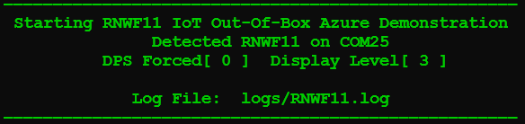 |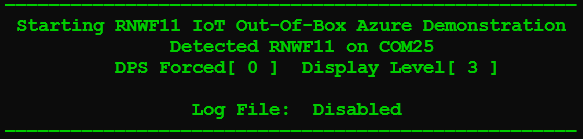   |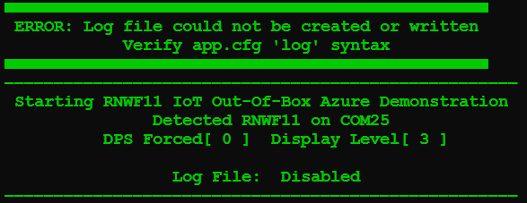|


#### Examples
| Log String |Unique<br>Log|Overwrites<br>Log|Description |
|:--|:--:|:--:|:--|
|"%M.log" (Default)|No*|Yes|Log file name uses the 'Device Model' and is only *unique per device model.<br>e.g. ".\logs\RNWF11.log"|
|"OneFile.log"|No|Yes|A single log is used for all executions and Device Models.<br>e.g. "\logs\OneFile.log"|
|""|n/a|n/a|Log file is disabled and log path is not created.|
|"%M_%D_%T.log"|Yes|No|Creates unique log files by adding time and date.<br>e.g. ".\logs\RNWF11_Dec_01_2023_13-02-59.log"|
|"./../MyTest/%M_%T.log"|Yes|No|Creates 'MyTest' log folder at same directory level as the script.<br>e.g. ".\MyTest\RNWF11_13-02-59.log"|
|"./../../Parent/%M_%T.log"|Yes|No|Creates 'Parent' log folder in the parent directory of the script.<br>e.g. "..\Parent\RNWF11_13-02-59.log"|
|"./%M/%D_@_%T.log"|Yes|No|Saves log files in 'Device Model' folders under the default ".\log" folder.<br>e.g. "\logs\RNWF11\Dec_01_2023_@_13-01-59.log" |
|"./%M/%M.txt"|No|Yes|Same as above except a single log per 'Device Model' is written as a 'txt' file.<br>e.g. "\logs\RNWF11\RNWF11.txt"<br>e.g. "\logs\RNWF02\RNWF02.txt" |
|||||

### _App.cfg_ - Do Not Change (Orange)

These values are specific to Azure and should not be changed. Changing any of these value will prevent the device from connecting to Azure.
* The 'ntp_server' field should not be adjusted if NTP time is aquired and is working for this demo. If however, the NTP server does not work in your locale, change the field to a more local server and retest.
* The 'device_template' is preset in the Azure cloud and provided by Microchip during DPS registration. It defines all the telemetry, parameter and commands supported by this demo. This setting should work for the demo and should not need to be changed. If for some reason it is not automatically set, the original device template can be manually uploaded to your Application from the Azure app site. The file is available in the "\Tools\DeviceTemplate" folder of this project.
* 


|App.cfg "field"|Default|Description|
|:--|:--|:--|
|"mqtt_broker_url"|"g2-cert-dps.azure-devices-provisioning.net"|Azure broker web address|
|"mqtt_broker_port"|"8883"|MQTT default network port for Azure|
|"tls_provision_server"|"*.azure-devices-provisioning.net"|Azure DPS provisioning service web address|
|"tls_device_server"|"*.azure-devices.net"|Azure's TLS server web address|
|"device_template"|"dtmi:com:Microchip:AVR128DB48_CNANO;1"|Microchip's default device template|
|"ntp_server"|"0.in.pool.ntp.org"|Default Network Time Protocol server. Can be changed for your region if desired|
|"mqtt_password"|"NA"|MQTT password is not required for Azure's secure and encrypted MQTT service.|
|"mqtt_version"|"3"|MQTT v3 is supported by Azure. MQTT v5 is not yet supported by Microsoft|
