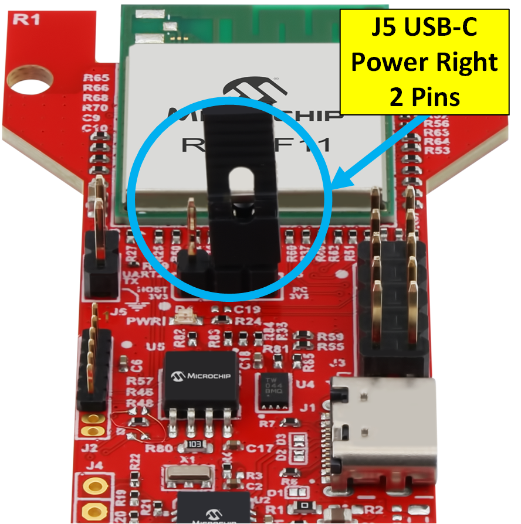
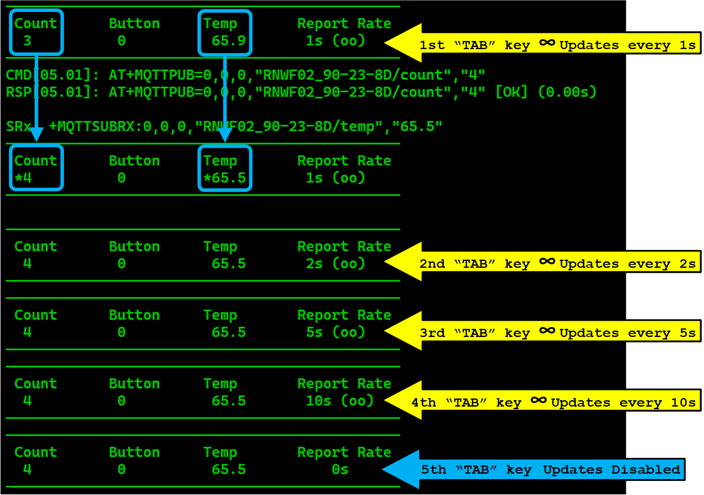
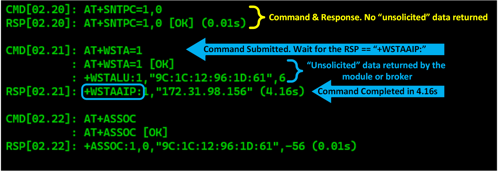
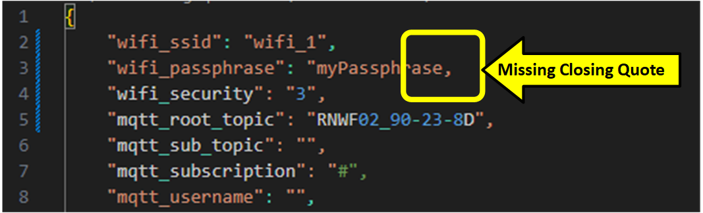
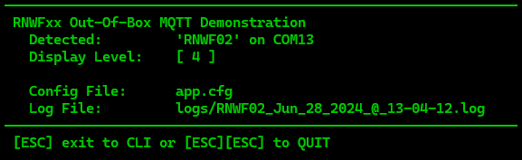
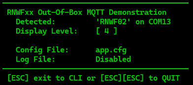

<a href="https://www.microchip.com"><p align="left"></a>

<!-- https://github.com/Ileriayo/markdown-badges -->


<!-- https://shields.io/badges/static-badge -->
[y]: https://img.shields.io/badge/-Yes-Green
[n]: https://img.shields.io/badge/-No-red
[tls]: https://img.shields.io/badge/-TLS-blue
[open]: https://img.shields.io/badge/-Open-green
[unpw]: https://img.shields.io/badge/-UnPw-yellow
[opt]: https://img.shields.io/badge/-OPTIONAL-green
[req]: https://img.shields.io/badge/-REQUIRED-orange
[rec]: https://img.shields.io/badge/-RECOMMENDED-yellow
[esc]: https://img.shields.io/badge/-ESC-grey
[ent]: https://img.shields.io/badge/-ENTER-grey

[p1883]:https://img.shields.io/badge/-Port_1883-8E7A9E
[p1884]:https://img.shields.io/badge/-Port_1884-8E7A9E
[p8883]:https://img.shields.io/badge/-Port_8883-73CED0
[p8884]:https://img.shields.io/badge/-Port_8884-73CED0
[p8886]:https://img.shields.io/badge/-Port_8886-73CED0

<!-- [tbd]: https://img.shields.io/badge/-TBD-yellow
[tag]: https://img.shields.io/badge/-MyTag-blue
[todo]: https://img.shields.io/badge/-ToDo-FF0000 -->

<!-- ![ALT][opt]  = [OPTIONAL] in Green -->

# RNWFxx MQTT Python OOBDemo (Out of Box Demo)

To request support for this demo please visit [Microchip Technical Support Portal](https://microchip.my.site.com/s/). Support is not provided via the Github support links.

## Introduction

This document describes how to connect a Microchip RNFWxx to the free MQTT broker [test.mosquitto.org](https://test.mosquitto.org/). Without any configuration other than setting Wi-Fi credentials, the user can create an "unencrypted", "unauthenticated" connection to the broker on port 1883 and immediately update telemetry and receive subscription data in real time. The demo also includes instructions and pre-defined configuration files for ```TLS``` encryption and authentication using most of the MQTT ports described on the [test.mosquitto.org](https://test.mosquitto.org/) site.

## Overview

This demo requires no setup, subscriptions or accounts. After the user enters valid Wi-Fi credentials, the demo automatically publishes and subscribes to 3 predefined telemetry values using the publicly available [test.mosquitto.org](https://test.mosquitto.org/) broker using the open MQTT port ```1883```. After connecting to the broker, the user can publish new telemetry values and observe the updates via a subscription to the same telemetry values in a Windows command shell.

With the included Python Certificate tool, the user can generate their own self-signed x509 certificates, upload them to the device and enable various levels of TLS authenticated and encrypted MQTT connections in a few minutes.

### Test Mosquitto Broker Limitations

>The [test.Mosquitto.org](https://test.mosquitto.org/) broker has limited resources and therefore limited capabilities. It's a free server that literally serves the entire world on an "Intel Atom N2800" for free. MQTT traffic published and subscribed to on this server may or may not work depending on the server load, time of day or Internet congestion.
>
>As their website states, "**do not rely** on this broker for anything of importance and **do not publish** anything sensitive, anybody could be listening".

* Observed MQTT Broker Issues
  * Delayed or lost MQTT telemetry
  * Connection failures requiring two or more attempts
  * Subscription telemetry not returned in publication order
  * Individual publications returned as combined subscription telemetry<br>
    (Demo handles this as long as data is not corrupted)
* If connection issues occur without an command error message...
  * First try the ```R``` CLI key command to reset and reboot 2 or 3 times.
  * Or try a full exit with ![ALT][esc] ![ALT][esc], then re-run the demo.

### Connection Support for [test.Mosquitto.org](https://test.mosquitto.org/)

|Supported|Port | Encrypt  |  Auth  |TLS| Description |
|:-:|:-|:-:|:-:|:-:|:-|
|![ALT][y]|1883|       | | | Default open connection|
|![ALT][y]|1884|       |&check;|       | Authenticated with Username and Password|
|![ALT][y]|8883|&check;|       |&check;| TLS Encrypted connection with self-signed certificates|
|![ALT][y]|8884|&check;|&check;|&check;| TLS Encrypted/Authenticated connection with self-signed certificates|
|![ALT][n]|8885|&check;|&check;|&check;| TLS Encrypted/Authenticated |
|![ALT][y]|8886|&check;|       |&check;| TLS Encrypted using module's built-in "Lets Encrypt" certificate|

### Document References 

#### RNWF02 [Product Page](https://www.microchip.com/en-us/development-tool/ea32m85a)

* [RNWF02 Application Developer's Guide](https://onlinedocs.microchip.com/g/GUID-92FEB3A1-C10F-47DF-BF88-C06521800526)
  * AT+ Command Reference for RNWF02 FW v2.0.0 [PDF](https://ww1.microchip.com/downloads/aemDocuments/documents/WSG/ProductDocuments/SupportingCollateral/AT-Command-Specification-v2.0.0.pdf)
  * AT+ Command Reference for RNWF02 FW v1.0.0 [PDF](https://ww1.microchip.com/downloads/aemDocuments/documents/WSG/ProductDocuments/SupportingCollateral/AT-Command-Specification-v1.0.0.pdf)
* Add on Board User's Guide [PDF](https://ww1.microchip.com/downloads/aemDocuments/documents/WSG/ProductDocuments/UserGuides/RNWF02-Add-On-Board-User-Guide-DS50003575.pdf) [HTML](https://onlinedocs.microchip.com/g/GUID-52DD287B-BC7E-48D9-88EF-A3075A09154B)
* RNWF02 Wi-Fi Module Datasheet [PDF](https://ww1.microchip.com/downloads/aemDocuments/documents/WSG/ProductDocuments/DataSheets/RNWF02-Wi-Fi-Module-Data-Sheet-DS70005544.pdf) [HTML](https://onlinedocs.microchip.com/g/GUID-3DDF7D25-768C-4E66-8343-E56E3AE4B4BB)

#### RNWF11 [Product Page](https://www.microchip.com/en-us/development-tool/ev12h55a)

* [RNWF11 Application Programming Guide](https://onlinedocs.microchip.com/g/GUID-209426F5-2F78-4B3F-80A0-AD79A119381E)
  * AT+ Command Reference for RNWF11 v1.0.0: See the ```AT Commands``` chapter in the [RNWF11 Application Programming Guide](https://onlinedocs.microchip.com/g/GUID-209426F5-2F78-4B3F-80A0-AD79A119381E)
* Add-on Board User's Guide [PDF](https://ww1.microchip.com/downloads/aemDocuments/documents/WSG/ProductDocuments/UserGuides/RNWF11-UART-to-Cloud-Add-on-Board-User-Guide-DS50003638.pdf) [HTML](https://onlinedocs.microchip.com/g/GUID-54AFBFDB-C8C6-43AE-8FFF-5D5F9C84C783) 
* RNWF11 Wi-Fi Module Datasheet [PDF](https://ww1.microchip.com/downloads/aemDocuments/documents/WSG/ProductDocuments/DataSheets/RNWF11-Wi-Fi-Module-Family-Data-Sheet-DS70005555.pdf) [HTML](https://onlinedocs.microchip.com/g/GUID-FEC46964-0385-48FA-B67F-A4A957B568A2)

### [Software Prerequisites](#software-prerequisites-and-installations)

### [Clone this Repository](#clone-this-repository-1)

### [Hardware Requirements](#hardware-requirements-1)

### [Hardware Preparation](#hardware-preparation-1)

### [Certificates for Authentication and Security](#certificates-for-authentication-and-security-2)

  * #### [Certificates for Authentication and Security](#pre-built-configuration-files)

  * #### [Uploading Certificates to the Add-on Board](#uploading-certificates-to-the-add-on-board-1)
  
### [Running the Demo](#running-the-demo-1)

  * #### [Using Port 1883](#oob-demo-unencrypted--unauthenticated)

  * #### [Using Port 1884](#oob-demo-unencrypted--authenticated)

  * #### [Using Port 8883](#oob-demo-encrypted--unauthenticated)

  * #### [Using Port 8884](#oob-demo-encrypted--client-certificate-required)

  * #### [Using Port 8886](#oob-demo-encrypted--unauthenticated-1)

  * #### [App.cfg Options](#appcfg)

  * #### [MQTT Options](#mqtt-options-1)

### [Demo Using Multiple RNWFxx Add-on Boards](#multiple-add-on-board-option)

## Demo Command Line Parameters

The ```oobdemo.py``` supports the command line argument, ```-c or --cfg```, to set the default configuration file from ```app.cfg``` to one of their choosing. It is NOT required to create the file nor the path. If the path and/or file does not exist, both will be created. If the drive is specified, it MUST exist or an error will occur.

Any legal configuration filename and extension can be used as long as the internal JSON is correctly formatted.

``` text
Syntax:
  python oobdemo.py                           # Uses the default "app.cfg" file located in the root project folder
  python oobdemo.py -c .\cfgs\p8883.cfg       # Relative path to the ```\cfgs``` folder config files
  python oobdemo.py -c "test.txt"             # "test.txt" used and/or create as the configuration file.
  python oobdemo.py -c "D:\Temp\app.json"     # Configuration file "app.json" is used from the "D:\Temp" folder"
  python oobdemo.py --cfg "D:\Demo\app.txt"   # The path "\Demo" and "app.txt" are created if needed on "D:\Demo"
  python oobdemo.py --cfg "D:/Temp/app.json"  # Forward slashes, '/', are also supported.
  python oobdemo.py --cfg .\cfgs\p8886.cfg    # Access provided cfg's for ports 1883, 1884, 8883, 8884 or 8886.
```

### Demo Command Line Help

Passing ```-h or --help``` will display the "oobdemo.py" supported parameters.


## Configuration with ```app.cfg```

The Python script **"oobDemo.py"** uses an external JSON file to record network and configuration parameters.
Once the default ```app.cfg``` file has been created, the demo will present the user with a Wi-Fi Access Point selection menu. After the AP is selected and a passphrase entered, the script has all the information it needs to connect and communicate with the [test.mosquitto.org](https://test.mosquitto.org/). Nothing else is required except access to the Internet via the default port 1883 using the selected Wi-Fi access point.

> ## App.cfg [More Info](#appcfg)

# Software Prerequisites and Installations

> **Note:** Third party applications referenced here and elsewhere in this document are not associated with Microchip Technologies Inc. and their use is at the sole discretion of the user.<br>
You are responsible for complying with third party license terms applicable to your use of third party software (including open source software) that may accompany this Microchip software.

* Windows 10 or later.
  
* [Git v1.7.10 or later](https://git-scm.com/). Latest version is recommended.
  
* [Python 3.10.11 or later](https://www.python.org/downloads/). Other versions may work, but have not been tested.

  * Select "Add python.exe to PATH during installation [Recommended]
  
     
  
* After installation, open a command prompt in your ```RNWFxx_Python_OOB``` folder
* Execute the command:

     ``` dos
     C:\RNWFxx_Python_OOB\pip install -r requirements.txt
     ```

     > If not performed, the Demo will prompt the user on start.
* [Windows Terminal](https://learn.microsoft.com/en-us/windows/terminal/install) (Better version of ```cmd.exe```) ![ALT][opt]
  
* [Terminal Emulator](https://en.wikipedia.org/wiki/List_of_terminal_emulators) program of your choice. ![ALT][opt]
  * Must support 230,400 baud 
  * Setting the serial terminal ![ALT][ent] key behavior on transmit to "CR + LF".
  * [Tera Term](https://ttssh2.osdn.jp/index.html.en) 
    * 'Enter' behavior: Menu->Setup-Terminal...<br> New-line, Receive: "CR", Transmit: "CR+LF"

* Certificate ```sendTo_tool``` - Use Windows Explorer's "right click" function to install device certificates to the RNFWxx module. ![ALT][opt]<br>

  > Certificates are ONLY required if connecting to the MQTT broker using TLS security and/or encryption on ports 8833, 8884 or 8886.
    Unsecured connections on ports 1883 or 1884 do not required certificates or this tool.

  * Full instructions are available [here](./tools/sendTo_tool/CertKeyFlashTool.md) and can be installed from the project's ```\Tools``` folder
  
     ```RNWFxx_OOBDemo\Tools\SendTo\install.cmd```

# Clone this Repository

Create a clone of this [repository](https://github.com/MicrochipTech/RNWFxx_Python_OOB/tree/main) using the [Git](https://git-scm.com) tool in a command line window

```bash
git clone https://github.com/MicrochipTech/RNWFxx_Python_OOB.git
```

As an alternative, scroll up towards the top of this page, click on the **Code** button, and download a ZIP file of the repository.


# Hardware Requirements

1. One or more RNWFxx Add-on boards (Any revision)
2. One or more USB-C cables (1 per Add-on board)
3. Smart phone with "hot spot" capability ![ALT][rec]<br>**Corporate IT departments often block MQTT network ports**
4. PC running Windows 10 or later with available USB port(s)
   * USB Hub for additional USB ports ![ALT][opt]

# Hardware Preparation

* Set the power jumper, J201(RNWF02) or J5(RNWF11) to pins 2 & 3. This sets the Add-on board to use USB-C power.
* Connect the "RNFWxx" Add-on board to a Windows PC with a "USB-C" cable
  
|RNWF02|RNWF11|
|:-:|:-:|
|||

## RNFWxx Serial Test

* With the RNFWxx ```Add-on``` board connected via a USB-C cable, verify a _RED_ LED indicating power, is illuminated on the board.
  
* If the LED is not illuminated, verify the ```Power Jumper``` is set according to the images above for your Add-on board.
  * Also check the USB cable and verify the driver for the UART has been loaded via Windows Device Manager.
  * If the new COM port is known, set that in the Terminal program.
    * Configure the port for **230400 baud, 8N1** once enumerated after plugging in the board.
    * Set the ![ALT][ent] key [behavior](#software-prerequisites-and-installations) to send "CR + LF" or "\r\n". **The device will NOT respond if this is set improperly.**

* In the terminal, pressing ![ALT][ent] should result in an error message:
  
  * If the error message is displayed, the terminal and PC are ready to run the demo.
  
     ``` text
     ERROR:0.2,"Invalid AT Command" 
     ```

* **BEFORE RUNNING THE DEMO**: Make sure the terminal is closed or disconnected!
  
* If the error message is not displayed, continue with the next section [RNFWxx Serial Port Troubleshooting](#rnfwxx-serial-port-troubleshooting).

### RNFWxx Serial Port Troubleshooting

>If the ```Add-on``` board does not respond there a few things to try.

1. Verify the COM port is configured **230400 baud, 8N1**.
2. Verify the Terminal is set to send "CR + LF" or "\r\n" on transmit. If this is not set, the ```Add-on``` board will not respond to commands!
3. Disconnect any other USB based UART Add-on board from the PC. Bluetooth UARTs do not need to be disconnected.
4. Unplug the ```Add-on``` board and then plug it in again. The PC should make a connection sound and show a new COM port in Device Manager. If it does not, you may need to install the driver for the UART.
5. Close any other terminals, or programs which may be using the same COM port. This includes the "oobDemo.py" Python script.
6. Make sure the terminal is set to the correct COM port.
7. Try disconnecting from the Add-on board using a software "Disconnect" then "Connect" again. Sometimes this helps to jump start the communication.
8. Disconnect the Add-on board, reboot the host PC and try again.
9. If all else fails, locate a known good serial device/Add-on board, reconfigure it and verify the PC, terminal and USB cable are working.


# Certificates for Authentication and Security

![ALT][req] For MQTT ports ```8883```, ```8884``` and ```8886``` Only

This step is only required if the demo is using TLS certificates or a broker connection on ports ```8883```, ```8884``` or ```8886```. Certificates are not required for ports ```1883``` or ```1884```. The demo includes a Python  script to automatically generate the required ```self-signed``` x509 TLS certificates.

The certificate tool's ```readme``` documents the certificate creation process. This only takes a few seconds. After the required ```ClientCert.crt``` and ```KeyCert.key``` are created, the third certificate, ```mosquitto.org.crt```, is downloaded from [test.mosquitto.org](https://test.mosquitto.org/) to the same folder as the self-signed certificates created earlier.

>Note: The downloaded ```mosquitto.org.crt``` will be recognized by the module under the name ```mosquitto``` after uploading it to the module's file system. The module removes the extension(s) ```.org.crt``` by design during the upload.
>
>References to this certificate or any certificate with filename extensions, must use this convention for configuration files such as "app.cfg" or ```AT+``` commands. The built in CLI commands ```DEL``` and ```DIR``` also use this convention. This applies to uploaded certificate ```key``` files as well.

[Python Certificate Tool](./tools/CertificateTool/readme.md)
Once again, this tool and the certificate upload process are only required when communicating with the broker using TLS certificates on ports ```8883```, ```8884``` or ```8886```.

# Uploading Certificates to the Add-on Board

![ALT][req] For ports ```8883```, ```8884``` and ```8886``` Only

This step is only required if the desired MQTT broker connection is using TLS with a port number greater than or equal to ```8000```. Before TLS encryption and authentication can work, x509 Certificates must be uploaded to the module's file system. The utility provided in the ```.\Tools\sendTo_tool``` folder allows the user to right-click on certificates displayed in Windows Explorer to perform the upload.

[SendTo Certificate Tool](./tools/sendTo_tool/readme.md)

Once the three certificates, ```Client.crt```, ```KeyCert.key``` and ```mosquitto.org.crt``` have been flashed, any of the TLS connection methods described in this demo can be run. Installing certificates to the module's file system is only required one time / module.

If user needs to update or delete certificates, the OOBDemo application provides a certificate [DEL](#del--c--k--filename) command from the CLI. Listing installed certificates and certificate keys is also supported with the [DIR](#dir--c--k--list-certificates--keys-command) command.

## Pre-built Configuration Files

In the OOBDemo's project folder, the subdirectory ```.\cfgs```, contains configuration files for all the TLS and non-TLS connection types on ports ```1883```, ```1884```, ```8883```, ```8884``` and ```8886```. The user can run the demo using these alternative configurations using the command line parameter ``` -c file.ext ``` when starting up the demo. When executing the demo to utilize these files, the files will be overwritten with Wi-Fi parameters from the user prompt. If you want to preserve these files, copy them to the root project folder and access them with the ```-c config_file.cfg``` command line option.

```Cmd
Example:
  python oobdemo.py - c p8886.cfg         # Syntax if cfg files moved to project folder
  python oobdemo.py - c .\cfgs\p8886.cfg  # Syntax if cfg files in sub-folder
```

|Configuration File|Port | Encrypt  |  Auth  |TLS| Description |
|:-|:-|:-:|:-:|:-:|:-|
|```p1883.cfg```|1883|       | | | Default open connection|
|```p1884.cfg```|1884|       |&check;|       | Authenticated with Username and Password|
|```p8883.cfg```|8883|&check;|       |&check;| TLS Encrypted connection with self-signed certificates|
|```p8884.cfg```|8884|&check;|&check;|&check;| TLS Encrypted/Authenticated connection with self-signed certificates|
|```p8886.cfg```|8886|&check;|       |&check;| TLS Encrypted using module's built-in "Lets Encrypt" certificate ```ISRGRootX1```|

# Running The Demo

The first time the demo is run the ```app.cfg``` file is populated with the required parameters to send and receive MQTT telemetry to the default server at [test.mosquitto.org](https://test.mosquitto.org/). The communication is over port ```1883``` for an unencrypted, unauthenticated connection. Internally the script creates a unique ``` MQTT ID ``` by using the Microchip module's "name" plus the last 3 bytes of its network MAC address. eg: ``` "RNWF02" + "40:84:32:90:23:8D" = "RNWF02_90-23-8D" ```. In this way, each Add-on board running the demo is guaranteed a unique MQTT login identification and helps protect the client from being disconnected by the broker due to duplicate login names.

### [Demo with Multiple RNWFxx Add-on Boards](#multiple-add-on-board-option)

### Port 1883 Quick Start

Once Python v3.11.x or later is installed and registered in the system path, clone this repository to a local folder and open a command prompt in that folder. Connect the Add-on board using a USB-C cable and verify the red power LED illuminates. Then execute the Python script with:

``` dos
python oobdemo.py
```

|Wi-Fi Setup|Connected|Interact (Demo)|
|:-:|:-:|:-:|
||||

After the demo starts...

* Use the ```B``` key to toggle the "button" from 0 to 1 and back to 0.
* Use the ```C``` key to increment the "count".
* Use the ```T``` key to randomly update the "temperature" plus or minus 5 degrees.
* And more...


## OOB Demo (**Unencrypted** & **Unauthenticated**)

![ALT][p1883] This is the _default_ MQTT connection type supported by the demo. It requires no extra configuration other than Wi-Fi credentials which will be set configuration file used.

**Command line syntax:**
``` text
python oobdemo.py                           # Uses default parameters, port 1883, in "app.cfg"
python oobdemo.py -c .\cfgs\p1883.cfg       # Use provided preconfigured config file
```
[View "app.cfg" default config file](./app.cfg)

[View "p1883.cfg" predefined config file](./cfgs/p8883.cfg)

  **Key Configuration File Settings for port 1883**

  ``` json
  "device_cert_filename": "ClientCert",       # Not Used
  "device_key_filename": "ClientKey",         # Not Used
  "ca_cert_name": "mosquitto",                # Not Used
  "mqtt_username": "",                        # Empty
  "mqtt_password": "",                        # Empty
  "mqtt_broker_url": "test.mosquitto.org",    # REQUIRED
  "mqtt_broker_port": "1883",                 # REQUIRED
  "ntp_server_ip_addr": "162.159.200.1",      # Not Used

  REQUIRED:       This value MUST be set
  Not Used:       Setting is ignored and can remain populated
  Empty:          Must be set to an empty string ""
  ```

### 1. Connect the RNWFxx Add-on board to the PC with a USB-C

* The power LED should illuminate.

### 2. Open a command prompt in the Github OOB Demo source/project folder & execute the command

* After a few seconds the user will be prompted for their Wi-Fi AP credentials.

  ``` text
    python oobdemo.py
           or 
    python oobdemo.py -c .\cfgs\p1883.cfg
  ```

### 3. At the Wi-Fi menu prompt, enter the index number for your SSID, then the passphrase if prompted.

* Selected Wi-Fi credentials are written to the ```app.cfg``` file and subsequent executions will not re-prompt the user.
* The passphrase prompt will not appear if the selected AP's security is set to 'OPEN'.
  |Wi-Fi Menu Example|Wi-Fi Setup Steps|
  |:-:|:-:|
  || Type the index number for the desired AP and press ENTER.<br>Type the ```passphrase``` for the AP and press ENTER.<br>The Wi-Fi security is set automatically.<br><br>The script will attempt to login to the AP and attach to the MQTT broker.<br><br>If the Wi-Fi connection fails, press ![ALT][esc] one or two times.<br><br><br>Edit the ```app.cfg``` file and verify the Wi-Fi password.<br>If adjusted, save the file and rerun the script as before.|

### 4. Script should complete at the interactive Demo screen
|||
 |:-:|:-|
 |This is the "Demo's" opening CLI screen.<br> CLI help is shown on start and is<br> available via the single key command ```H```.<br><br>The lower panel of the help screen contains <br> MQTT broker version, subscription & topic information.||

## OOB Demo (**Unencrypted** & **Authenticated**)

![ALT][p1884]  This is an alternative broker connection using port 1884 and requires the broker's _username_ and _passwords_. To enable this connection method, make the "app.cfg" changes shown or use the preconfigured configuration file.

Execution will be identical to that of the default port 1883 execution shown previously.

* ![ALT][req] MQTT Username set to ```"rw"``` as defined by the [test.mosquitto.org](https://test.mosquitto.org/) broker

* ![ALT][req] MQTT Password set to ```"readwrite"``` as defined by the [test.mosquitto.org](https://test.mosquitto.org/) broker
  
**Command line syntax:**

``` text
python oobdemo.py -c .\cfgs\p1884.cfg       # Use provided preconfigured config file
```

[View "p1884.cfg" predefined config file](./cfgs/p1884.cfg)

  **Key Configuration File Settings for port 1884**

  ``` json
  "device_cert_filename": "ClientCert",       # Not Used
  "device_key_filename": "ClientKey",         # Not Used
  "ca_cert_name": "mosquitto",                # Not Used
  "mqtt_username": "rw",                      # REQUIRED
  "mqtt_password": "readwrite",               # REQUIRED
  "mqtt_broker_url": "test.mosquitto.org",    # REQUIRED
  "mqtt_broker_port": "1884",                 # REQUIRED
  "ntp_server_ip_addr": "162.159.200.1",      # Not Used

  REQUIRED:       This value MUST be set
  Not Used:       Setting is ignored and can remain populated
  Empty:          Must be set to an empty string ""
  ```

## OOB Demo (**Encrypted** & **Unauthenticated**)

![ALT][p8883] ![ALT][tls] This is an alternative broker connection using TLS on port 8883 and certificates uploaded to the device. To enable this connection method, make the "app.cfg" changes shown or use the preconfigured configuration file.

Execution will be identical to that of the default port 1883 execution shown previously.

* ![ALT][req] [Create Self Signed Certificates](#certificates-for-authentication-and-security-2)

* ![ALT][req] [Uploading Certificates to the Add-on Board](#uploading-certificates-to-the-add-on-board-1)


**Command line syntax:**

``` text
python oobdemo.py -c .\cfgs\p8883.cfg       # Use provided preconfigured config file
```

[View "p8883.cfg" predefined config file](./cfgs/p8883.cfg)

  **Key Configuration File Settings for port 8883**

  ``` json
  "device_cert_filename": "ClientCert",       # REQUIRED(uploaded)
  "device_key_filename": "ClientKey",         # REQUIRED(uploaded)
  "ca_cert_name": "mosquitto",                # REQUIRED(uploaded)
  "mqtt_username": "",                        # Empty
  "mqtt_password": "",                        # Empty
  "mqtt_broker_url": "test.mosquitto.org",    # REQUIRED
  "mqtt_broker_port": "8883",                 # REQUIRED
  "ntp_server_ip_addr": "162.159.200.1",      # REQUIRED

  REQUIRED:       This value MUST be set
  Not Used:       Setting is ignored and can remain populated
  Empty:          Must be set to an empty string ""
  ```

## OOB Demo (**Encrypted** & Client Certificate Required)

![ALT][p8884] ![ALT][tls] This is an alternative broker connection using TLS on port 8884 and certificates uploaded to the device. To enable this connection method, make the "app.cfg" changes shown or use the preconfigured configuration file.

Execution will be identical to that of the default port 1883 execution shown previously.

* ![ALT][req] [Create Self Signed Certificates](#certificates-for-authentication-and-security-2)

* ![ALT][req] [Uploading Certificates to the Add-on Board](#uploading-certificates-to-the-add-on-board-1)

**Command line syntax:**
``` text
python oobdemo.py -c .\cfgs\p8884.cfg       # Use provided preconfigured config file
```

[View "p8884.cfg" predefined config file](./cfgs/p8884.cfg)

  **Key Configuration File Settings for port 8884**

  ``` json
  "device_cert_filename": "ClientCert",       # REQUIRED(uploaded)
  "device_key_filename": "ClientKey",         # REQUIRED(uploaded)
  "ca_cert_name": "mosquitto",                # REQUIRED(uploaded)
  "mqtt_username": "",                        # Empty
  "mqtt_password": "",                        # Empty
  "mqtt_broker_url": "test.mosquitto.org",    # REQUIRED
  "mqtt_broker_port": "8884",                 # REQUIRED
  "ntp_server_ip_addr": "162.159.200.1",      # REQUIRED

  REQUIRED:       This value MUST be set
  Not Used:       Setting is ignored and can remain populated
  Empty:          Must be set to an empty string ""
  ```  

## OOB Demo (**Encrypted** & Unauthenticated)

![ALT][p8886] ![ALT][tls] This is an alternative broker connection using TLS on port 8886 and certificates uploaded to the device. To enable this connection method, make the "app.cfg" changes shown or use the preconfigured configuration file.

Execution will be identical to that of the default port 1883 execution shown previously.

* ![ALT][req] [Create Self Signed Certificates](#certificates-for-authentication-and-security-2)

* ![ALT][req] [Uploading Certificates to the Add-on Board](#uploading-certificates-to-the-add-on-board-1)

**Command line syntax:**
``` text
python oobdemo.py -c .\cfgs\p8886.cfg       # Use provided preconfigured config file
```

[View "p8886.cfg" predefined config file](./cfgs/p8886.cfg)

  **Key Configuration File Settings for port 1884**

  ``` json
  "device_cert_filename": "ClientCert",       # REQUIRED(uploaded)
  "device_key_filename": "ClientKey",         # REQUIRED(uploaded)
  "ca_cert_name": "ISRGRootX1",               # REQUIRED(built in)
  "mqtt_username": "",                        # Empty
  "mqtt_password": "",                        # Empty
  "mqtt_broker_url": "test.mosquitto.org",    # REQUIRED
  "mqtt_broker_port": "8886",                 # REQUIRED
  "ntp_server_ip_addr": "162.159.200.1",      # REQUIRED

  REQUIRED:       This value MUST be set
  Not Used:       Setting is ignored and can remain populated
  Empty:          Must be set to an empty string ""
  ```  

## Using Other MQTT Brokers

To connect to a broker that is not ```test.mosquitto.org```, edit the ```app.cfg```, or create a custom configuration file with the new broker's parameters and run the demo. When setting up an alternate broker, here are few things to keep in mind.

This application uses the MQTT port number to automate TLS command activation and functions. If the MQTT port number is greater than or equal to ```8000```, TLS is assumed. If less than ```8000```, a non-TLS connection is assumed.

* If the broker **is not using TLS**, the MQTT port must be less than ```8000```.
* If the broker is authenticated with a ```username``` and ```password```:
  * MQTT port must be less than ```8000```

    ``` json
    "device_cert_filename": "ClientCert",       # Ignored for non-TLS connections
    "device_key_filename": "ClientKey",         # Ignored for non-TLS connections
    "ca_cert_name": "mosquitto",                # Ignored for non-TLS connections
    "mqtt_username": "brokerUserName",          # Required for username/password authentication ONLY. eg: port 1884
    "mqtt_password": "brokerPW",                # Required for username/password authentication ONLY. eg: port 1884
    "mqtt_broker_url": "myCustomBroker",        # Must be a valid URL or IP address
    "mqtt_broker_port": "1884",                 # Required
    "ntp_server_ip_addr": "162.159.200.1",      # Ignored for non-TLS connections
    ```

  * If the broker **is using TLS**
    * MQTT port must be ```8000``` or greater
  
    ``` json
    "device_cert_filename": "ClientCert",       # Must use key certificate filename uploaded or already present in module's file system
    "device_key_filename": "ClientKey",         # Must use key certificate filename uploaded or already present in module's file system
    "ca_cert_name": "mosquitto",                # Must use key certificate filename uploaded or already present in module's file system
    "mqtt_username": "",                        # Must be empty for all connections except Username/PW authenticated connections
    "mqtt_password": "",                        # Must be empty for all connections except Username/PW authenticated connections
    "mqtt_broker_url": "myCustomBroker",        # Must be a valid URL or IP address
    "mqtt_broker_port": "8884",                 # Must be 8000 or greater for TLS connections
    "ntp_server_ip_addr": "162.159.200.1",      # Must be set for TLS connections and should be an IP address. Avoid using URL's.
    ```

## Using 3rd Party MQTT Clients

There are several 3rd party MQTT clients that can publish and subscribe to the MQTT [test.mosquitto.org](https://test.mosquitto.org/) site used in this demo. The required parameters are displayed in the final demo screen and when requesting "demo help" with the ```H``` single key command. The bottom section contains these parameters:

* mqtt_version: Value must be 3 or 5. Default in configuration file, ```app.cfg``` is version ```"3"```
  * Ref: ```app.cfg: mqtt_version```
* mqtt_broker: Broker URL. Default in configuration, ```app.cfg``` file ```"test.mosquitto.org"```
  * Ref: ```app.cfg: mqtt_broker_url```
* mqtt_port: Default in configuration, ```app.cfg``` file is ```"1883"```.
  * Ref: ```app.cfg: mqtt_broker_port```
* mqtt_subscription: Default is the wildcard ```"#"```. The full subscription string is shown and equals:<br> ```"mqtt_root_topic"``` + Last 3 Bytes of module's MAC address / ```"mqtt_sub_topic"(if used)``` / ```"mqtt_subscription"```
  * Ref: ```app.cfg: mqtt_root_topic, mqtt_sub_topic, mqtt_subscription```
* **MQTT ID:** Is internally generated and shown for reference only. MQTT ID and the Root Topic ***CAN BE DIFFERENT*** as shown here.
  


|[MQTT Explorer](https://mqtt-explorer.com/) Connection|[MQTT Explorer](https://mqtt-explorer.com/) Interface|
|:-:|:-:|
|||

## Interacting with the Demo

Instead of entering telemetry data, the demo supports single key commands to update telemetry. Depending on the key, the representative telemetry is either incremented(COUNT), toggled(BUTTON) or set to a random value(TEMP). 

There is a single key command, ```I```, to update telemetry at different intervals 10 times, and an option to update all telemetry values continuously using the ```TAB``` key.

There are 2 commands related to certificates uploaded to the module. The ```dir``` can list certificates and key files, while the ```del``` can remove them.

Three additional commands, ```scan```, `sys` and an ```AT+``` commands are also available. 

The ![ALT][esc] key allows the user to exit the demo to a command line interface or CLI to execute any of the 3 commands previously mentioned.

From the CLI, the user can use the ![ALT][esc] key a second time to exit the demo completely.

### ```H``` Help Key

The ```H``` key displays a help screen plus MQTT connection info for reference during the demo and from within the CLI. This key command is case-insensitive.

### ```AT+``` CLI Commands

Both the demo and the CLI allow the user to send raw ```AT``` commands as defined in the "AT Commands" section of the Application Developer's Guide for the Add-on board used. The code assumes that any command that starts with the ``` + ``` character is an ```AT``` command and prepends ```AT``` prior to uploading it to the module for execution.

This command is case-sensitive and must be all ```CAPS```.

Both versions of this "GMR" command are equivalent and will result in the same output. The output from a RNWF02 Add-on board is shown below. Other Add-on boards are similar.

``` js
+GMR

AT Command = AT+GMR
CMD[00.02]: AT+GMR
RSP[00.02]: AT+GMR +GMR:"2.0.0 0 e41f977cb [16:31:26 Apr 12 2024]" [OK] (0.00s)
───────────────────────────────────────
 Firmware Info:
   Version:     2.0.0
   Security:    0
   Date:        16:31:26 Apr 12 2024
   Hash ID:     e41f977cb
───────────────────────────────────────
```

### ```DIR [ c | k ]``` List Certificates / Keys Command

The ```DIR``` command is used to display the RNWFxx's file system for either certificates or certificate key files. Each type exists in their own separate "folder" and requires a secondary parameter to distinguish between them. This key command is case-insensitive.

#### List "Key" Certficates

``` dos
    dir k
    . . .
    ───────────────
    Dir Keys (1)
    ───────────────
    1    "ClientKey"
```

#### List "Certificates"

``` dos
    dir c
    . . .
    ────────────────────────
    Dir Certificates (12)
    ────────────────────────
    1    "DigiCertGlobalRootG2"
    2    "ISRGRootX1"
    . . .
    10   "EnTrust"
    11   "ClientCert"
    12   "mosquitto"
```

### ```DEL [ c | k ] FileName```

The ```DEL``` command is used to remove certificates or keys from the module's file system. Care should be taken with this command, as it can and will delete "built-in" certificates that are included with the firmware. If a built in certificate is deleted, the only way to re-install it, is by re-flashing the firmware.

To delete a certificate or key, two parameters are required. The first parameter must be a 'c' or a 'k', specifying a "certificate" or "key". The second and last parameter is the exact certificate or key file name and capitalization matters.

This command is case-insensitive for the ```DEL``` command and its ```c``` and ```k``` options, but is **case sensitive** for the certificate/key FileName. The filename capitalization must be the same as displayed by the ```DIR``` command or the ```DEL``` command will fail. Use the ```DIR [c | k]``` command to verify the filename to verify its capitalization.

``` dos
To delete a certificate named "MyCert"

del c MyCert    <= File will be deleted. Capitalization matches and the file is a certificate not a key.
del c mycert    <= Delete fails because capitalization does not match the file system, "MyCert".
del k MyCert    <= Will fail because the file is a certificate, not a key.

```

### ```R``` Resume / Restart key

The ```R``` key allows the user to reconnect to the MQTT broker or Wi-Fi AP depending on the connection status of the two. Note that sometimes the Add-on board is not aware it has been disconnect from the broker and may instead report an error. If this occurs a second press of the ```R``` key will then restart the demo from the beginning with a full reset of the Add-on board. 

This key command is case-insensitive.

> Restarting the demo in this way does not cause the ```app.cfg``` file to be reread. The demo will use the settings originally read when it was first executed.

### MQTT Reconnect Simulation

* With the demo running and connected to the broker
* Issue the command, ``` +MQTTDISCONN ```. Notice the disconnection message.
* Then press the ``` R ``` key to reconnect.

``` js
AT Command = AT+MQTTDISCONN
CMD[05.01]: AT+MQTTDISCONN
RSP[05.01]: AT+MQTTDISCONN [OK] (0.00s)
─────────────────────────────────────────
 Event: Broker DISCONNECTED - By Command
─────────────────────────────────────────

then 'R' is pressed...

─────────────────────────────────────────────
Attempting to reconnect to the MQTT Broker...
─────────────────────────────────────────────
■■■■■■■■■■■■■■■■■■■■■■■■■■■■■■■■■■■■
 4 - APP_STATE_MQTT_CONNECT_BROKER
■■■■■■■■■■■■■■■■■■■■■■■■■■■■■■■■■■■■
. . .
```

### Wi-Fi Reconnect Simulation

The ```R``` can also reconnect the Wi-Fi if the AP drops the connection.

* With the demo running and connected to the Wi-Fi and MQTT broker
* Issue the command ```+MQTTDISCONN``` to disconnect the broker.
* Follow that with the command ```+WSTA=0``` to disconnect the Wi-Fi.
* Then issue the ```R``` command to reconnect Wi-FI and the MQTT broker.
  * If the client fails to reconnect, issue the ```R``` command again.

``` js
AT Command = AT+MQTTDISCONN
CMD[05.01]: AT+MQTTDISCONN
RSP[05.01]: AT+MQTTDISCONN [OK] (0.00s)
─────────────────────────────────────────
 Event: Broker DISCONNECTED - By Command
─────────────────────────────────────────

AT Command = AT+WSTA=0
CMD[05.01]: AT+WSTA=0
RSP[05.01]: AT+WSTA=0 [OK] (0.00s)

───────────────────────────
 Event: Wi-Fi Disconnected
───────────────────────────

then 'R' is pressed...

────────────────────────────────────
Attempting to reconnect to the AP...
────────────────────────────────────
■■■■■■■■■■■■■■■■■■■■■■■■■■■■
 2 - APP_STATE_WIFI_CONNECT
      SSID:     'wsn'
      SECURITY: '3'
■■■■■■■■■■■■■■■■■■■■■■■■■■■■
. . .
```

### Resume Demo (Full Reset & Run)

If the user is running the demo, and presses the ESC key 1 time, the demo stops and exits to the CLI. In the CLI, the user cannot directly re-enter the demo. To rerun the demo, there are 2 options.

1. Press ![ALT][esc] one more time to exit the demo back to the shell and rerun the Python script.
   * The ![ALT][esc] option is like a HARD reset. The program is rerun from the shell and the ```app.cfg``` file **IS** reread.
2. Press ```R``` one time and the script will restart the demo starting at the initial RESET state.
   * The ```R``` options is like a SOFT reset. The Add-on board is reset, but the script never exits to the shell and the ```app.cfg``` is **NOT** reread. The original values from the initial execution are used instead

### ```C```, ```B```, ```T``` Single Key Telemetry Commands

The demo supports "single character" commands to update the 3 telemetry values "count", "button" and "temp".

This key commands are case-insensitive.

|||
|:-:|:-:|
|First the data is initialized on the broker.<br><br>The ```C``` key increments the "count"<br><br>The ```B``` key toggles the button value<br><br>The ```T``` key updates the temperature||

### ```I``` & ```TAB``` Single Key Telemetry Commands

Two special key commands are ```I``` and ```TAB```. These key commands automatically update each of the 3 telemetry values, but in different ways. They allow the demo to send a series of telemetry 10 times or update telemetry forever until commanded to stop.

This commands are case-insensitive.

Pressing the ```I``` key will start a count down of 10 updates. Each update will toggle the ```button```, increment the ```count``` and adjust the ```temp``` a randomly temperature delta between -5 to +5 degrees. Each press of the ```I``` key will start a count down from 10 updates "every 2 seconds". The next ```I``` press changes to "every 5s", then "every 10s". Another ```I``` press, returns to "0s" and the updates stop.

With the ```I``` key, once the count down reaches zero, telemetry updates stop and the "Report Rate" returns to 0s.


Pressing the ```TAB``` key performs the same function as the ```I``` command but updates all telemetry values _forever_. Pressing the ```TAB``` key also cycles through the update period like the ```I``` key cycling through 0s, 1s, 2s, 5s, 10s then back to 0s.

To turn off the telemetry updates, press & release the ```I``` or ```TAB``` keys until the CLI shows the "Report Rate" as "0s". On each press the "Report Rate" will cycle to the next value; 0, 1, 2, 5, 10 then back to 0.<br>

  |'I' Key Updates Every 1, 2, 5 or 10s...<br>10 Times & Stops|'TAB' Key Updates Every 1, 2, 5 or 10s...Forever|
  |:-:|:-:|
  |||

### ```SCAN``` Command (AT+WSCN=0)

From within the Demo or the CLI the ```SCAN``` command is used to get a comprehensive list of all the detected Wi-Fi access points. It provide more information than the Wi-Fi selection menu displayed at the start. From the Demo or CLI issue the command ```SCAN``` to view the results. 

This command is case-insensitive.

* The output provided includes the SSID's MAC address, AP Channel, Security setting as defined for the module, Signal Strength (RSSI), and the SSID itself.


### ```SYS``` Command (AT+GMM | AT+GMR | AT+NETIFC | AT+FS=4 | AT+ASSOC)

From with the Demo or the CLI, the ```SYS``` command displays the output of multiple commands in a single report. These commands were sent earlier during initialization with the data captured and parsed by the script.

This key command is case-insensitive.

The output shows the Model Name, Firmware Version and Info, Module's MAC Address and File System Info, Assigned IP address in IPv4 and IPv6 and the Associated Access Point's MAC and RSSI value. The command is not case sensitive.


### ```AT``` Commands

The last available Demo/CLI command is the generic AT module command. Any command documented in the ```AT Command``` section of the Application Developer's Guide, is a supported within the Demo. The command syntax has two forms: With the prefix ```AT``` or without. The latter is just a shortcut, where the user is not required to enter the ```AT``` portion. The code interprets commands beginning with the ```+``` symbol as an ```AT``` command and prepends ```AT``` portion prior to submission to the module's UART. This command is case sensitive and must be all caps.

Examples:
```
+GMR      # Is the same as "AT+GMR"
+NETIFC   # Is the same as "AT+NETIFC"
```

#### AT Command ```Copy & Paste```

When the user is running the Demo or CLI, they have the option of sending ```AT``` commands to the Add-on board manually. The command sent must be a supported and use the proper syntax. This feature provides a way of experimenting with the module's ```AT``` command interface without much effort or code changes.

If for example, we wanted to set the ```temp``` telemetry value to "700.9" degrees, how is this done?

There are two options. The first option is to use the AT Command documentation for the syntax, parameters and methods to manually construct the command, then enter that string to the CLI. This will work, but requires some effort.

The second option utilizes the Demo's previously sent commands as a template for the required syntax. Just before the Demo state, the default telemetry values are set with the required "AT+MQTTPUB" command. All we need is a ```COPY & PASTE``` of that command, and a quick edit.

|||
|:-|:-:|
|1. In the CLI, scroll the display up to the "AT+MQTTPUB" commands.<br>2. Locate the [CMD] that set the ```temp``` value to 78.0 degrees.<br>3. Highlight the command as shown and press ![ALT][ent] to ```COPY```.<br><br><br>```Terminal Copy:```<br> - Left Mouse Click, Hold & Drag over text and release<br> - Press ![ALT][ent] or [CTRL-C]<br>```Terminal Paste:```<br> - Mouse R-Click or [CTRL-V]||
|4. Scroll the CLI back down and ```PASTE``` the copied text. ||
|5. Backspace over the ```"78.0"``` portion.<br>6. Change it to ```"700.9"```.<br>7. Don't forget the closing quote and press ![ALT][ent].||
|Here is the result. The command was sent successfully.<br><br>The ```[CMD] & [RSP]``` indicate success immediately.<br>The subscription response ```[SRx]``` may take longer depending on the broker load.||

### Troubleshooting

  If the demo app fails to execute all the way to the Demo at the end, try exiting and rerun the demo. Like rebooting a PC, rebooting the RNWFxx Add-on board often helps.
  |Issue|Solution|
  |:-:|:-|
  |Wi-Fi does not connect|Press ![ALT][esc]![ALT][esc] to exit, then rerun the app|
  |Wi-Fi connection still fails...|Exit the app, double check your Wi-Fi credentials in the ```app.cfg``` file. <br>If needed edit and save. Then rerun the app.<br>Optional: Delete the ```app.cfg```, rerun and re-enter the Wi-Fi credentials.|
  |Fails to connect to Broker|The network port may be blocked by the network admin. Trying using a cell phone's 'hotspot' feature as a Wi-Fi access point.<br>Start by enabling the hotspot. Then delete the ```app.cfg```, rerun the demo, and enter the new hotspot Wi-Fi credentials at the menu prompts.|
  |Broker disconnected immediately|This occurs when the broker or the module detects invalid MQTT parameter(s). An incorrect password or MQTT port can cause this. Edit the 'app.cfg' file and correct the invalid parameters before saving the file.<br><br>**Note: In a corporate IT environment, MQTT ports are usually blocked, but not always. Sometimes one MQTT port such as 1883 works fine, while the authenticated port 1884 is blocked and fails. If in doubt, try a different network such as a cell phone's "mobile hotspot" for the Wi-Fi connection.** |
  |Broker disconnected after 45 seconds|This can be caused by the lack of MQTT telemetry and the Add-on board drops the connection. Sending telemetry manually using one of the single key commands, ```B```, ```C``` or ```T``` can reset the timeout. Otherwise the user can increase the timeout period by adjusting the ```mqtt_keep_alive``` period in the ```app.cfg``` file.|

### Exiting the Demo

The Python script can be exited at any time by pressing the ![ALT][esc] key _twice_. While the script is running, the first press of the ![ALT][esc] key will enter a Command Line Interface(CLI). While in the CLI, a second press of the ![ALT][esc] key will exit the Python script back to the OS.

``` text
If the Python script becomes nonresponsive, use CTRL-X to exit the Python script.
```

# How the "oobDemo.py" Works

## Execution Overview

The script sends ```AT``` commands to the RNFWxx module one at a time, waiting for a response "RSP" back from the module or web service. The script will not proceed until it receives a response. If no response is received within the default or programmed timeout period, the script will fail the command and exit to the CLI. Most commands use the string "OK" as its response text to wait for. These commands are typically Wi-Fi or MQTT programming commands sent to the module and return in less than a second.


  
* The first command, ```AT+SNTPC``` is a setup command and completes in less than a second with a module response string of ```AT+SNTPC=1```.
  
  * This command completed almost immediately because it is a setup command for the RNFWxx module, which can  respond immediately.
  
* The second command, ```AT+WSTA=1```, connects to a Wi-Fi access point and is set to wait until an IP address is assigned.
  * The command is programmed to wait for a ```+WSTAAIP:``` response string.
  
    * While the ```AT+WSTA=1``` command was processing, several strings were returned by the module, but did not match the string we were waiting for. These responses were **"unsolicited"**.
  
  * **The "Unsolicited Response" Strings**
    * If a string is returned that does not match the "wait" string, it is displayed without the ```RSP[XX:YY]``` prefix, then indented with a ":" and followed with the unsolicited response string.
  
    * The line display is for informational purposes and indicates the command is still processing and waiting for the correct response to be returned.
  
    * Once that response is received, the standard ```RSP[XX:YY]: Some String``` is displayed and the next AT command is processed.

### State and Sub-States

* Each command and response line item indicate the current execution State and SubState in the square brackets shown. i.e. **CMD[01:12]** and **RSP[01:12]**
  
* Every command must have a matching response, with the same **state:sub-state** values. If not, the command will timeout and the script will terminate with an error to the CLI.

* Sub-states typically execute in numerical order such as 1, 2, 3, etc. While executing some portions of the code, the execution may skip over one or more subsequent sub-states. This is not an error. Some sub-states, and their corresponding ```AT``` commands, are skipped because they are not needed or not supported with _this_ particular RNWFxx device.

## State Machine

There are 5+1 state machine "states" that run from state 1 to 5. States 1 through 4 perform increasingly important tasks from Initialization, Wi-Fi Connection, MQTT Setup, MQTT Login and finally the Demo itself in state 5.

State 0 represents a pseudo state, the +1 state (0). It is the Command Line Interface(CLI) and can be used for debug or sending AT+ commands to the RNWFxx module.

Entering the zero state can be done any time after the initial RNWFxx reset has completed by pressing the ![ALT][esc] one time. While in the zero state, a second press of the "ESC" exits the script to the OS. Sometimes an ![ALT][esc] results in a loss of communication with the RNWFxx. _If this occurs, use "CTRL-C" to terminate the script and retry._

### State Machine Generalities

States 1 though 4 all perform in a similar manner. Each sub-state within a state, sends an AT command and waits until the proper response string is received before moving on to the next AT command.

* Substate 0 of every state is where the state "banner" is displayed, unless disabled by the ```app.cfg``` setting ```display_level``` is set to '0'.

* Substates 1 though n-1 send setup AT+ commands to perform the required task of particular state.

* Substate 'n', or the final sub-state sends the final AT+ command to initiate the state's ultimate task, such as connecting to Wi-Fi or connecting to the MQTT broker.

  * When the final AT+ command is executed in a state, it usually takes much more time than the previous setup commands.

  * If the final AT+ command fails, it's usually caused by one or more of the previous setup commands for that state. This is because the RNWFxx checks each command and accepts it based syntax, not context. The module does not know what the task is until the final command. Once this occurs, the final command will fail if any of the previous setup commands were invalid.

    * A good example of this is a Wi-Fi connection. If the password is incorrectly set in state 2, sub-state 10, the module accepts the password based on syntax alone. It only fails when the module attempts to connect to the AP in state 2, sub-state 21.

      

    * When the AP connection is attempted at sub-state 21, it will fail due to the invalid password. Sub-state 21 failed, but the actual failure is at sub-state 10 where the wrong password was set.

|State|*SubStates|Name|Purpose|
|:------|:--:|:-----------:|:---------|
|0|n/a|APP_STATE_CLI|Interactive state for AT+ command execution + internal commands<br>Entered after ![ALT][esc] pressed 1 time or after a detected error.|
|1|~8|APP_STATE_INIT|Sends initial module reset command, retrieves firmware version & module's MAC address.|
|2|~16|APP_STATE_WIFI_CONNECT|Wi-Fi setup commands and initiates the Wi-Fi connection to an access point(AP).|
|3|~10|APP_STATE_MQTT_SETTINGS|Setup MQTT registers for data exchange with MQTT broker.|
|4|~5|APP_STATE_MQTT_CONNECT_BROKER|Initiates the MQTT broker connection, initializes and subscribes to telemetry data.|
|5|n/a|APP_STATE_DEMO|Final "demo" state where user can send and receive telemetry data, run commands or submit ```AT``` commands.|

\* The number of SubStates can vary depending connection type, MQTT, security settings, etc.

## CLI Commands (State 0)

The CLI can be executed any time after the initial script "reset" command or about 4 seconds after the Python script starts.

The CLI state will be entered anytime the user presses ![ALT][esc] one time during script execution. The CLI state is automatically entered if an error is reported back from the RNWFxx or the IoT cloud. If CLI AT+ command caused an error, the command and response displayed just prior to the error, should be reviewed. Some errors are decoded and provided on the display showing the likely cause and solution.

Eventually the script will start to execute and commands will start scrolling. Once this happens, press the ![ALT][esc] one time, and you should get a display like this:


At the prompt you can run any of the displayed commands. The table below explains the available command syntax. Feel free to experiment with the "SCAN" and "SYS" commands. They are informative commands and will not make any lasting changes to the RNFWxx Add-on board.

|CLI Command|Params|Syntax|Description|
|:-----:|:--:|:-----------:|:---------|
|HELP|0|help|Displays CLI help shown above.|
|AT+|-|AT+XXX=yyy|Any module supported AT+ command with or without ```AT```.<br>AT+ commands are case-sensitive.<br>example: **AT+WSTA=1 or +WSTA=1 are equivalent**|
|DIR|1|dir c \| k|Lists certificates or certificate key's from the module's file system.|
|DEL|2|dir c \| k filename|Deletes certificates or certificate key's from the module's file system.<br>The 'filename' parameter is case-sensitive.|
|SCAN|0|scan|Passively scans & displays available Wi-Fi routers/access points. This command<br> shows much more AP information than the Wi-Fi AP prompt including the AP<br> MAC Address, Channel, Security Setting, Signal Strength and SSID Name.|
|SYS|0|sys|Displays firmware, network, Wi-Fi, Module File System and Wi-Fi AP information|
|ESC|0|Press 'ESC' key|Exits the script to the OS|

## App.cfg

The ```app.cfg``` file contains all the settings required for the Python script to connect to the MQTT broker. No modification to the underlying Python script should be required. If the ```app.cfg``` file does not exist when the script is run, a default version will be created and the user will be prompted for any missing parameters. Not all parameters are required.

The ```app.cfg``` file is formatted in JSON, and can be modified by the user if desired, such as during the steps in this demo. When the JSON file is read by the Python script, it is checked for proper syntax. If any syntax errors are found, the script will indicate the probable fault and the approximate line number of the error.

|JSON Missing Closing Quote|Error Message |
|:-:|:-|
|||

The configuration file is only checked for JSON syntax, not for supported values. For example specifying ```"mqtt_version": "9"``` will fail when the MQTT command is sent to the module because only ```"3" or "5"``` are supported.

|Invalid MQTT Version |Runtime Error |
|:-:|:-|
|||

### General ```app.cfg``` JSON Rules

* All parameters and values are strings and MUST be surrounded by **quotes**. i.e. **"130"**
* All parameter, value pairs in the JSON file MUST end in a **comma** EXCEPT for the last line.
* Parameter and value pairs MUST be separated by a **colon**, i.e. **"wifi_ssid": "MySSID",**

### Configuration File Automation's

The default ```app.cfg``` file or a user named configuration file is the key settings file for the entire app. Modifications to this file can cause the program to fail, operate in a new mode or generate unique log files for every execution. Below are some things to keep in mind when manually editing the ```app.cfg``` file.

#### Changing the Wi-Fi SSID, Passphrase or Security Settings

If the Wi-Fi setting need to changed for any reason, there are several ways of updating the settings.

1. Delete the ```app.cfg``` file and rerun the ```OOBDemo``` script to be re-prompted for the Wi-Fi credentials.
1. Manually edit the ```app.cfg``` and set the desired parameters.
1. Edit the ```app.cfg``` file and set either the ```wifi_ssid```, ```wifi_passphrase``` or ```wifi_security``` to an empty string [ "" ], then save the file. On the next execution, the script will present the user with Wi-Fi selection menu.
   * If any of the Wi-Fi parameters are empty, or mis-configured, the user will presented with the Wi-Fi AP selection menu on the next run. This includes...
     * Empty values, [ "" ], unless security is set to '0' for an open network, then the passphrase must be an empty string [ "" ]
     * Network security is set to "0" for an open network and a ```wifi_passphrase``` is not an empty string ```""```.

``` json
{
    "wifi_ssid": "",
    "wifi_passphrase": "",
    "wifi_security": "",
    "device_cert_filename": "ClientCert",
    "device_key_filename": "ClientKey",
    "ca_cert_name": "mosquitto",
    "mqtt_root_topic": "",
    "mqtt_sub_topic": "",
    "mqtt_subscription": "#",
    "mqtt_username": "",
    "mqtt_password": "",
    "mqtt_version": "3",
    "mqtt_keep_alive": "45",
    "mqtt_broker_url": "test.mosquitto.org",
    "mqtt_broker_port": "1883",
    "ntp_server_ip_addr": "162.159.200.1",
    "display_level": "4",
    "at_command_timeout": "20",
    "log_filename": "%M_%D_@_%T.log"
}
```

| Field|Default|Set By|Automation|Description/Info|
|:--|:--:|:--:|:--:|:-|
|wifi_ssid|""|User|Wi-Fi Menu|Wi-Fi Menu selection|
|wifi_passphrase|""|User|Wi-Fi Menu|Wi-Fi Menu Selection after SSID selected|
|wifi_security|""|Auto|Wi-Fi Menu|Automatic via Wi-Fi Menu Selection|
|device_cert_filename|"ClientCert"|Auto<br>User|---|![ALT][tls] Certificate filename uploaded to the module<br>![ALT][tls] User can set their own certificates |
|device_key_filename|"ClientKey"|Auto<br>User|---|![ALT][tls] Certificate Key filename uploaded to the module<br>![ALT][tls] User can set their own certificates|
|ca_cert_name|"mosquitto"|Auto<br>User|---|![ALT][tls] Certificate Authority(CA) certificate<br>![ALT][tls] User can set their own certificates<br>```mosquito.crt``` (uploaded) or<br>```ISRGRootX1``` (built-in)|
|mqtt_root_topic|"Module+MAC"|Auto<br>User|Module + MAC<br>Manual|Auto set: ModuleName + last 3 bytes of MAC address<br>User may use any legal string here|
|mqtt_sub_topic|""|User|---|Optional sub-topic appended to the root topic|
|mqtt_subscription|"#"|Auto<br>User<br>User|---|#: Wild Card Default Shows All Telemetry<br>"": Empty string sets no subscriptions<br>eg: "temp", "button" or "count"|
|mqtt_username|""|User|---|User set for optional Username/password security<br>Port ```1884``` only; For all other ports must be blank ```""```|
|mqtt_password|""|User|---|User set for optional Username/password security<br>Port ```1884``` only; For all other ports must be blank ```""```|
|mqtt_version|"3"|Auto<br>User|---|"3": MQTT Broker Version<br>"5": User/Broker Option|
|mqtt_keep_alive|"45"|Auto<br>User|---|Default MQTT "Keep Alive" time in seconds before disconnection|
|mqtt_broker_url|test.mosquitto.org|Auto<br>User|---|Default Broker Auto Set<br>User MQTT Broker IP address or URL [OPTIONAL]|
|mqtt_broker_port|"1883"|Auto<br>User|---|```1883```: ![ALT][open] Unencrypted, Unauthenticated <br>```1884``` : ![ALT][unpw] Unencrypted, Authenticated <br>```8883``` : ![ALT][tls] Encrypted, Unauthenticated<br>```8884``` : ![ALT][tls] Encrypted, Client Cert Required<br>```8886``` : ![ALT][tls] Encrypted, Unauthenticated|
|ntp_server_ip_addr|"162.159.200.1"|Auto<br>User|---|![ALT][tls] Only used where network time is required for TLS<br> security when port > 7999.<br>IP address recommended; Avoid using a URL|
|display_level|"4"|Auto<br>User|---|"4": Maximum Info Displayed with Response Decodes<br>"3": Display Demo IoT Data<br>"2" Info & Events<br>"1": Display Banners<br>"0": Extra data Off, command/response only|
|at_command_timeout|"20"|Auto<br>User|---|Default timeout in seconds for AT commands to complete<br>Individual commands can use alternative timeout values.|
|log_filename|""%M_%D_@_%T.log""|Auto<br>User|---|Enabled: Model + Date @ Time.log<br>Disabled: ""|

### COM Port Setting Auto-Detection

The connected RNWFxx device is automatically detected at the start of the Python script. There is no manual override. Refer to "Check These First" section below for troubleshooting steps.

#### Check These First

1. Do you have a terminal open on the same port? Disconnect the terminal and try again.
2. Disconnect any additional modules or USB-to-UART adapters connected to the PC.
3. Is the terminal configured for the correct ![ALT][ent] behavior set as "\r\n" (Carriage Return + Newline)?
   * The device will not respond if this setting is not correct.
   * Refer [here](#software-prerequisites-and-installations) then **Terminal Emulation**.
4. Device has power and the red LED on the board displays brightly.
5. The OS shows the COM port in the Device Manager when plugged in which disappears when unplugged.
6. From a terminal configured as 230400b 8N1; Press the ![ALT][ent] key.
   * If you get a response such as ```ERROR:0.2,"Invalid AT Command"``` the device is communicating properly.
     * Double check with the command ```AT+GMM```. You should receive a part number in the terminal.

### MQTT Options

#### User MQTT Options

Adjustable MQTT options are available in the default ```app.cfg``` file, or an optional user named configuration file.  

> "app.cfg" edits applies to any user configuration file which also requires the command line option "-c MyCustom.cfg"<br>
   eg: ```python oobdemo.py -c MyCustom.cfg```

* Default MQTT Broker default is ```test.mosquitto.org```, but any broker that supports ```Unencrypted, Unauthenticated```, ```Unencrypted, Authenticated``` or TLS connections, can be used.
* MQTT versions ```3``` and ```5``` are supported. The default is version 3, while version 5 can be set in the configuration file.
  * Ref: ```app.cfg: mqtt_version```
  * eg: ```"mqtt_version": = "5"```

* The MQTT root topic is automatically created and set in ```app.cfg``` if empty on the first run. If the field is already set, it is not changed and used as is. When automatically created, the root topic will consist of the module name with the last 3 bytes of its MAC address as a postfix. The user is free to set any valid string by editing the ```app.cfg``` file as desired.
  * Ref: ```app.cfg: mqtt_root_topic```
  * eg: ```"mqtt_root_topic": "RNWF02_90-23-8D"``` ==> Full topic: "```RNWF02_90-23-8D```\\button"
  * eg: ```"mqtt_root_topic": "MyTopic"``` ==> Full topic: "```MyTopic```\\button"

* The MQTT Subtopic is an optional string set in the configuration file. When set by the user, it will be appended between the ```mqtt_root_topic``` and the built in topics of ```button```, ```count``` and ```temp```.
  * Ref: ```app.cfg: mqtt_sub_topic```
  * eg: ```"mqtt_sub_topic": ""``` ==> Full topic: "RNWF02_90-23-8D\button"
  * eg: ```"mqtt_sub_topic": "MySubTopic"``` ==> Full topic: "RNWF02_90-23-8D\\```MySubTopic``` \button"
  
* The MQTT subscription defined in ```app.cfg``` is automatically set to the "wild card" symbol ```#```. The string can be manually set to empty ```""``` to disable subscriptions, or to a custom subscription. The subscription string submission is created by adding the `root topic + sub topic(if specified) + subscription string.
  * Ref: ```app.cfg: mqtt_subcription```
  * eg: ```"mqtt_subscription": "#"``` ==> Subscription to all telemetry, "count", "button" and "temp"
  * eg: ```"mqtt_subscription": "count"``` ==> Subscription to "count" only.
  
#### Hardcoded MQTT Options

* There are 3 MQTT telemetry defined in this application, ```count```, ```button``` and ```temp``` and represent an integer count, a boolean and temperature float value. These are hardcoded and cannot be changed.
* The MQTT ID cannot be changed and will always use the automatically created ID. MQTT ID or the MQTT "login" name is internally created by using the module's name with the last 3 bytes of the its **unique** network MAC address as a postfix.
  * eg: ```RNWF02_90-23-8D``` or ```RNWF11_81-42-6E```
  
* MQTT ```QoS``` and ```Retain``` flags are both set to 0 and cannot be changed in this release.

* When accessing the [test.mosquitto.org](https://test.mosquitto.org/) MQTT broker supporting username & password authentication on port ```1884```, the username MUST be set to "rw" and "readwrite" respectively.
  * This is not hardcoded in the application, but is coded that way on the broker side.
  * If accessing the broker port and not using username/password authentication, these parameters **must** be empty.
  * eg: MQTT Port ```1884```
    * ```mqtt_username: "rw"```
    * ```mqtt_password: "readwrite"```
  * eg: MQTT Ports ```1883```, ```8883```, ```8884```, and ```8886```
    * ```mqtt_username: ""```
    * ```mqtt_password: ""```


### Log Files

The ```log_file``` option in the ```app.cfg``` file, allows the user to specify the log file name and its output path relative to the execution directory. The log definition string's default is "%M_%D_@_%T.log", which uses one of 3 supported substitution tokens described below. Log files are created and stored in the project file in the folder "\logs".

* **%M or %m**: These tokens are replaced by the 'Device Model' number; e.g. "RNWF02" or "RNWF11"
* **%D or %d**: The date token is replaced by the date in the form "MMM_DD_YYYY"; e.g. "Dec_01_2023
* **%T or %t**: The last token supports time in the form "HH-MM-SS"; e.g. "13-01-59". Hours are in military or 24H time.<br>
   eg: ```"My_%M_%D_@_%T.log"``` could create a log file named...<br>
   ```"My_RNWF02_Dec_01_2023_@_13-01-59.log"``` with a RNWF02 module or ...<br>
   ```"My_RNWF11_Dec_01_2023_@_13-01-59.log"``` with a RNWF11 module

   eg: ```"%M.log``` creates the log file name based on the module name...<br>
   ```RNWF02.log``` for a RNWF02 Add-on board<br>
   ```RNWF11.log``` for a RNWF11 Add-on board

* **%C or %c**: Option not shown. The ```%c``` inserts the configuration filename, without its extension into the log file name<br>
   eg:```"%M_%C.log``` creates the log file name based on the module name + the configuration filename...<br>
   ```RNWF02_app.log``` for a RNWF02 Add-on board<br>
   ```RNWF11_app.log``` for a RNWF11 Add-on board

#### Notes

* The default log definition, ```%M_%D_@_%T.log```, creates a unique log, that won't be overwritten because it contains the date & time the demo started running.
* The log definition, "%M.log", will be overwritten on each execution of the same device type; e.g. "RNWF02.log" or "RNWF11.log". Each device type will create its own log.
* The default "log" path, relative to the execution directory, is hard coded to the script folder as "\logs". The script path definition variable is "APP_CMD_LOG_PATH".
* The log string definition in 'app.cfg' can be modified to enable preservation of every log file as well as storing logs in different folders relative to the the execution path.
  * _Paths specified are automatically created and reported in application start banner if successful._
* When the user successfully exits the application with ![ALT][esc] ![ALT][esc], the 'app.cfg' contents are written to the end of the log.
  * _This does not occur if the user exits with [CTRL-C] or if the application exits due to a code fault._
* If the log definition is invalid, the log will not be created, but the execution will continue. The opening header on the CLI will indicate if the log creation was successful with the log file path and filename or failed by displaying **Disabled**.

> ```RNWF02 screen captures are shown, other modules will be similar...```

| Success |Disabled|Failure |
|:--:|:--:|:--:|
|"log_filename": "%M_%D_@_%T.log" (default)|    "log_filename": ""|"log_filename": "%M?.log" (illegal char '?' used) |
| |   ||

#### Examples

| Cfg String |Unique<br>Log|Overwrites<br>Log|Description |
|:--|:--:|:--:|:--|
|"%M.log"|No|Yes|Log file name uses the 'Device Model' and is only *unique per device model.<br>e.g. ".\logs\RNWF11.log"|
|""|n/a|n/a|Log file disabled.|
|"%M_%C.log"|Yes \| No|Yes \| No|Log file name uses the 'Device Model' plus the name of the configuration filename.<br>The log will be unique if each module uses a unique configuration file.<br>e.g. ".\logs\RNWF11_p8883_main.log" <= Config filename is "p8883_main.cfg|
|"OneFile.log"|No|Yes|A single log is used for all executions and Device Models.<br>e.g. "\logs\OneFile.log"|
|"%M_%D_%T.log"|Yes|No|Creates unique log files by adding time and date.<br>e.g. ".\logs\RNWF11_Dec_01_2023_13-02-59.log"|
|"./../MyTest/%M_%T.log"|Yes|No|Creates 'MyTest' log folder at same directory level as the script.<br>e.g. ".\MyTest\RNWF11_13-02-59.log"|
|"./../../Parent/%M_%T.log"|Yes|No|Creates 'Parent' log folder in the parent directory of the script.<br>e.g. "..\Parent\RNWF11_13-02-59.log"|
|"./%M/%D_@_%T.log"|Yes|No|Saves log files in 'Device Model' folders under the default logs folder.<br>e.g. "\logs\RNWF11\Dec_01_2023_@_13-01-59.log" |
|"./%M/%M.txt"|No|Yes|Same as above except a single log per 'Device Model' is written as a 'txt' file.<br>e.g. "\logs\RNWF11\RNWF11.txt"<br>e.g. "\logs\RNWF02\RNWF02.txt" |
|||||

## Multiple Add-on Board Option

If more than one RNWFxx Add-on board is available, multiple Add-on boards can be connected and intercommunicate between each other without addition configuration. All modules share the same configuration file, therefore all publish and subscribe to the same root topic.

When starting the Demo app with the ```app.cfg``` file deleted, the first Add-on board running the demo will set the ```"mqtt_root_topic"``` using its ```MODEL``` name plus the last 3 bytes of its unique network MAC address. After the user has entered the Wi-Fi credentials at the Wi-Fi Selection menu, the ```app.cfg``` file will be fully configured for any additional modules to connect and interact. The user just needs to run the demo from a new command prompt. One command prompt per Add-on board.

After the first Add-on board is connected to the MQTT broker, additional modules can be added to the limit of the available USB ports of the host PC.

**Note:** When starting from a default ```app.cfg``` file, the Demo sets a very important setting, the log file definition. The default will create a ***unique** log filename for each connected Add-on board because it adds the time and date to the filename. This is required!<br>
Do not use a static log file definition such as "%M.log" or "MyLog.log" because as each Add-on board is started, it will try and write to the same file. Either leave the default log definition at its default,```"log_filename": "%M_%D_@_%T.log"```, or turn off the log completely with the setting ```"log_filename": ""```.

> The procedures below indicate that "each" Add-on board should be attached "one-at-a-time" to the PC via its own USB-C cable. This is not actually required. The user **can** connect multiple modules to the PC before running the Demo even once.<br><br>
> At startup, the Demo begins by sending identification ```AT``` commands looking for an available ```Add-on``` board. If the UART port is "busy", as in already running the Demo, the next UART port is probed until a viable board is found. As long as an ```Add-on``` board's UART is not attached to a running instance of the Demo or in a Terminal, the Demo will eventually execute on next available board.<br><br>
> The Demo procedure was written this way so that the user knew exactly which ```Add-on``` board was the "main" client, vs "secondary" MQTT clients. If this is not important, attach all the modules at once and start executing multiple instances of the Demo.

## Multiple Add-on Board Setup and Execution\

1. In the project delete or rename the ```app.cfg``` file.
2. Connect a RNWFxx Add-on board using a USB-C cable to a PC running Windows.
3. Open a command prompt in the project folder and start the demo with ```python oobdemo.py```
4. Complete the Wi-Fi setup using the menu prompt and wait until the MQTT broker is connected.
5. Use any of the telemetry keys, ```B```, ```C```, or ```T``` to verify the connection.
6. Open a second command prompt in the same project folder
   * Attach another RNWFxx Add-on board and execute ```python oobdemo.py``` just like before.
   * Once the broker is connected, publish telemetry from the second Add-on board and note the first Add-on board's subscription receives the second ```Add-on``` board's publications.
7. Connect additional Add-on boards and repeat starting at ```Step 2```

> With this procedure, every attached ```Add-on``` board has subscribed telemetry updates. The CLI for every ```Add-on``` board will display all telemetry data regardless of the source board. <br>With a minor change, subscription data can be limited to the first ```Add-on``` board only, while all other ```Add-on``` boards act as publishers or sensor boards in a real world.

### Option: One Subscriber with Multiple Publishers

To demonstrate a single Add-on board as "MQTT" data collector, we can limit the first Add-on board as the one and only subscriber. All other attached modules will then only publish data and not "self" subscribe to that data. This is a more realistic scenario, as MQTT clients normally would not subscribe to their own published telemetry.

Only one change is required in the previous procedure. We have to disable the MQTT subscription after the first Add-on board connects.

* Starting with a deleted ```app.cfg``` as before...
* Follow the "Multi-Add-on Board Setup and Execution" procedure for the first Add-on board.
* After the 1st Add-on board connects and some telemetry is sent...
* Edit the ```app.cfg``` file, change the subscription setting to: ```mqtt_subscription: ""```, and save the file.
* Now continue attaching and running additional modules.

Now each additional ```Add-on``` board will not be subscribing to any telemetry. Only the first Add-on board will show telemetry updates because its the only one subscribed. Modules 2 through N will only publish telemetry.


#### One Subscriber with Multiple Publishers and Separate Configuration files

The above method can be simplified by using one configuration file for the main Add-on board to "subscribe", and separate configuration file for the remaining Add-on boards to "publish".

* Starting with a deleted ```app.cfg``` as before...
* Follow the "Multi-Add-on Board Setup and Execution" procedure for the first Add-on board.
* After the 1st Add-on board connects and some telemetry is sent...
  * Exit the Demo with ![ALT][esc] ![ALT][esc]
  * Copy the ```app.cfg``` file with a new file name ```sub.cfg```
  * Copy the ```app.cfg``` to a second new file named```pub.cfg```
  * Edit the ```pub.cfg``` file, changing<br>
    ```"mqtt_subscription": "#" to "mqtt_subscription": ""```
  * Save the ```pub.cfg``` file
* Start your main Add-on board with the command:

  ``` dos
    python oobdemo.py -c sub.cfg
  ```

* For all other Add-on boards that will publish telemetry, start a new command terminal and run:
  
  ``` dos
    python oobdemo.py -c pub.cfg
  ```
