<a href="https://www.microchip.com"><p align="left"></a>

<!-- https://github.com/Ileriayo/markdown-badges  -->


# Create Self-Signed Certificates for RNWFxx using Python

Creating self-signed device certificates is semi-automated and only takes a few seconds. 

Running the included Python script, ".\CertificateTool\mosquittoCSR.py" will 
create the required 

## Software
* Windows 10 or later.
* [Python 3.10.11 or later](https://www.python.org/downloads/). Other versions may work, but have not been tested.

   * Select "Add python.exe to PATH during installation [Recommended]
   
   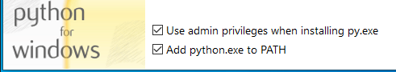
* [Windows Terminal](https://learn.microsoft.com/en-us/windows/terminal/install) (```cmd.exe``` A better version of ```cmd.exe```) [Optional]

## Procedure

1. Open a command prompt in the folder ``` ...\RNWFxx_Python_OOB\tools\CertificateTool ```
2. Execute the Python script with the command line:
``` python mosquittoCSR.py ```
3. If the script detects missing required Python modules, the user will be prompted to install them.
    
   
   
   > Once installed, rerun the script to proceed.
4. Next the user is prompted to verify the default certificate settings.
   
   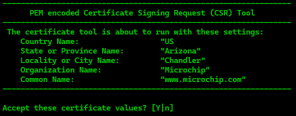

   * If acceptable, press 'Y' [ENTER] 
   * If not, press 'N' [ENTER] to exit the script.
     * Edit the values in the Python script, save and rerun.
   
       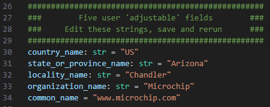
   
5. At the next prompt, open the displayed link in a browser and press [ENTER].
    > URL: [https://test.mosquitto.org/ssl/](https://test.mosquitto.org/ssl/)

   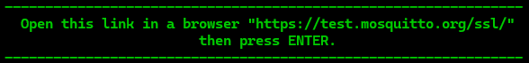
   
6. Press [ENTER] to complete the certificate creation process.
7. The final screen should appear as shown.
   > Take note of Option 1. The "CSR" created, has already been copied to your clipboard!

   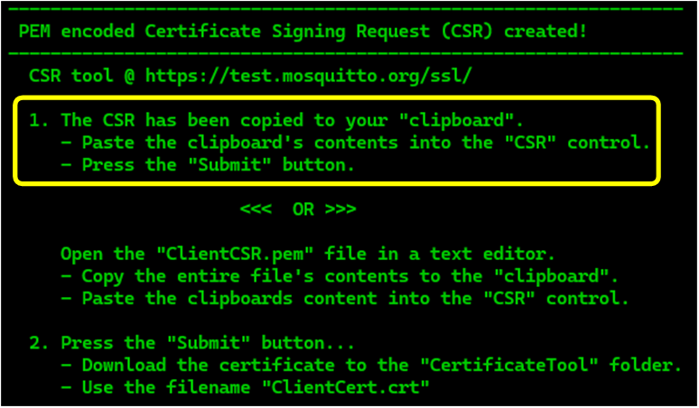

   | | |
   |:-:|:-----------:|
   |[test.mosquitto.org TLS Cert Tool](https://test.mosquitto.org/ssl/) open in a browser.<br><br>Right-Click in the control and paste the 'CSR' text from the clipboard.<br><br> OR <br><br> Open the file ```ClientCSR.pem``` file, copy the contents from a text editor and then paste. |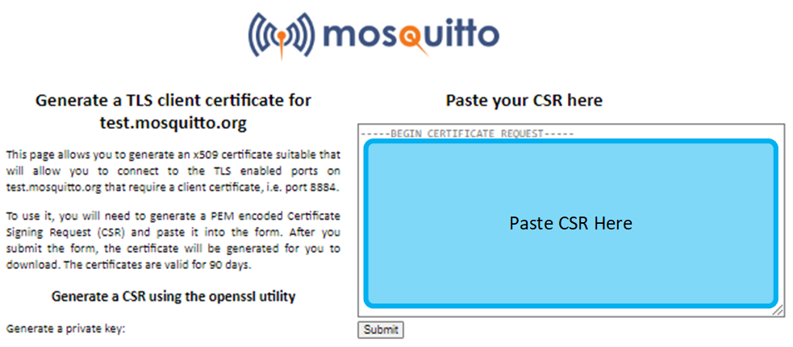|
   |```ClientCSR.pem``` pasted into the tool.<br><br>Then press ```Submit```|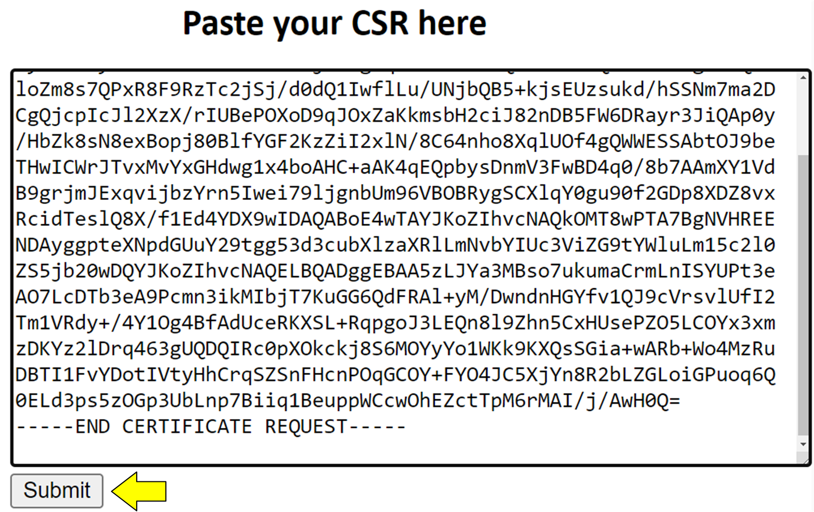|
   |At the file save prompt, select a folder of your choice and save the file with the name<br>``` ...\RNWFxx_Python_OOB\tools\CertificateTool\ClientCert.crt ``` |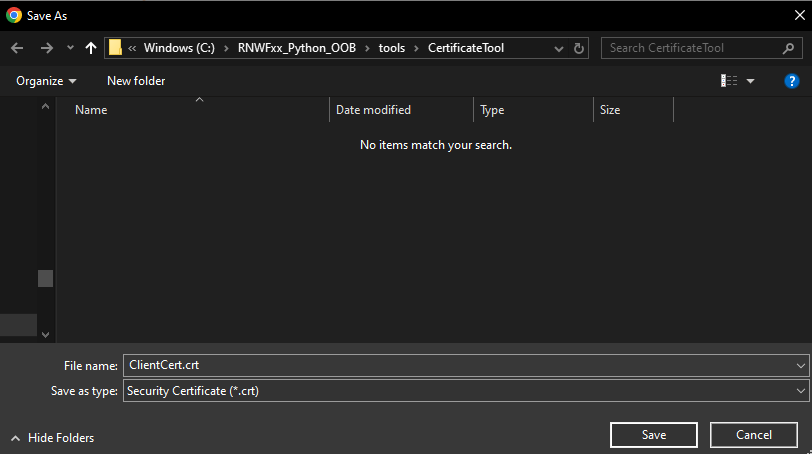|

8. The final step is to download the [mosquitto.org.crt](https://test.mosquitto.org/ssl/mosquitto.org.crt) certificate.
   * Click on the hyperlink above for a direct download of the ```mosquitto.org.crt``` certificate.
   
     OR
   
   * Navigate to the [test.mosquitto.org](https://test.mosquitto.org) web site and click on the ``` PEM Format ```certificate link.

   |||
   |:-:|:-:|
   |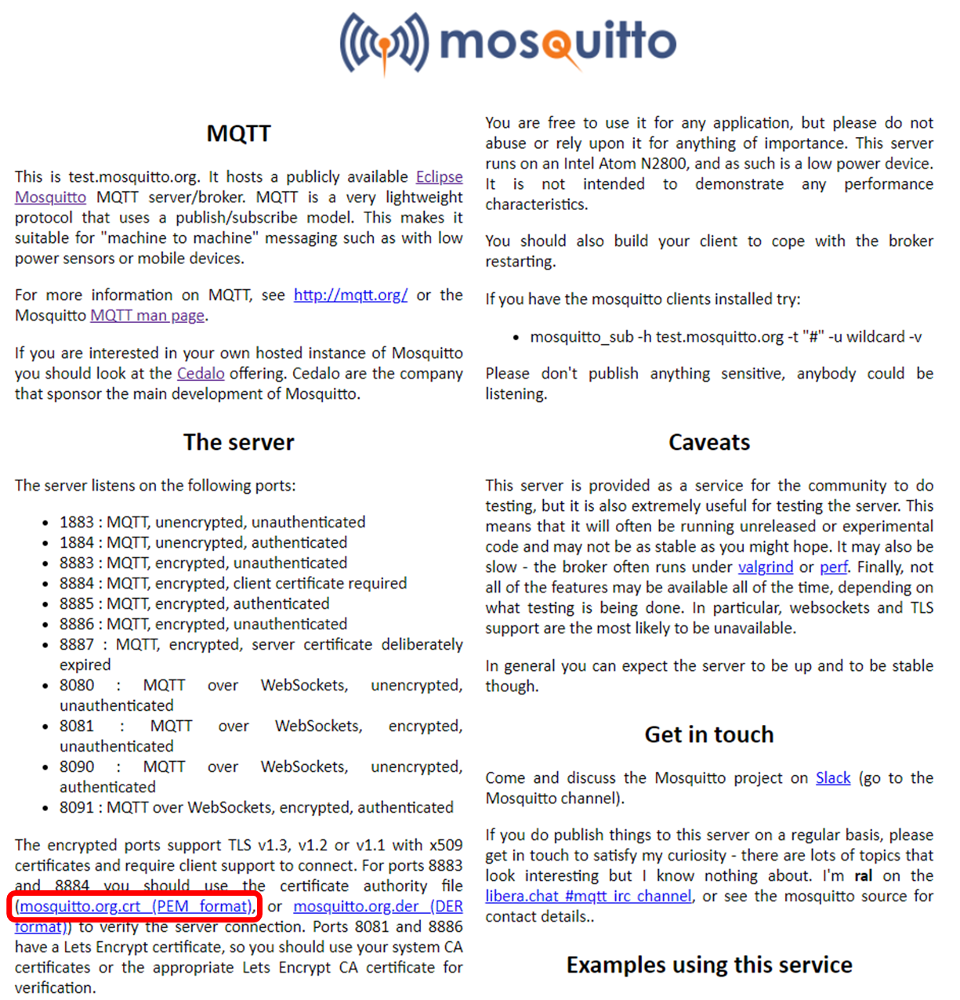| 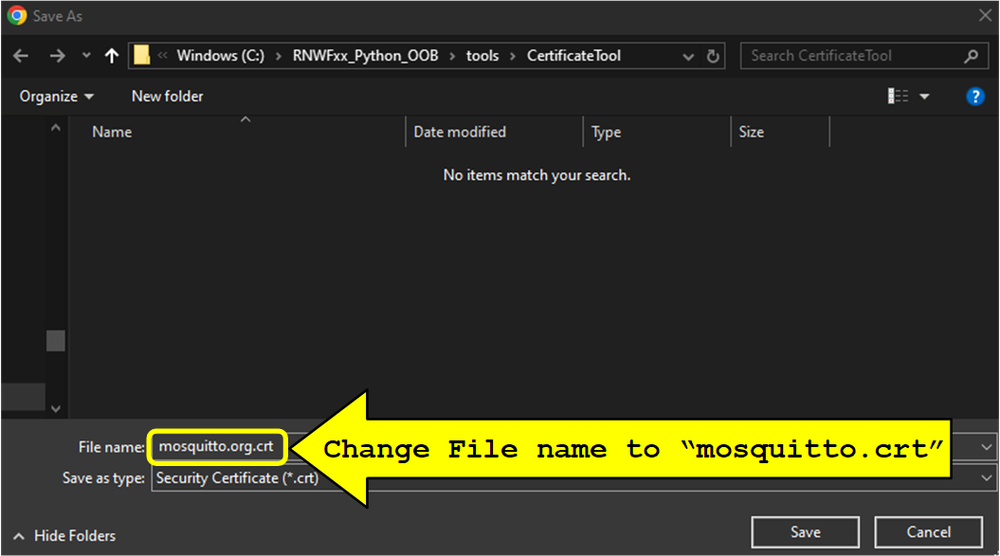<br><br> At the download prompt, save the certificate with filename ```mosquitto.crt``` in the<br> same folder as the previous certificate files eg:<br>``` ...\RNWFxx_Python_OOB\tools\CertificateTool\ ``` |
   |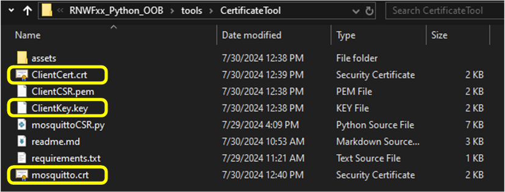| All the required certificates for the demo should be in this folder.<br>```ClientCert.crt```, ```ClientKey.crt```, and ```mosquitto.crt```.<br><br> **Recommended:** Make a backup of these certificates in a different folder, <br> so they do not get overwritten if the script is run again|


## [Return to the Python OOBDemo...](../../readme.md#certificates-for-authentication-and-security-1)