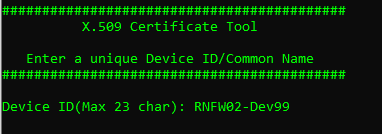
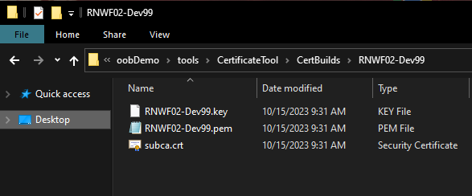
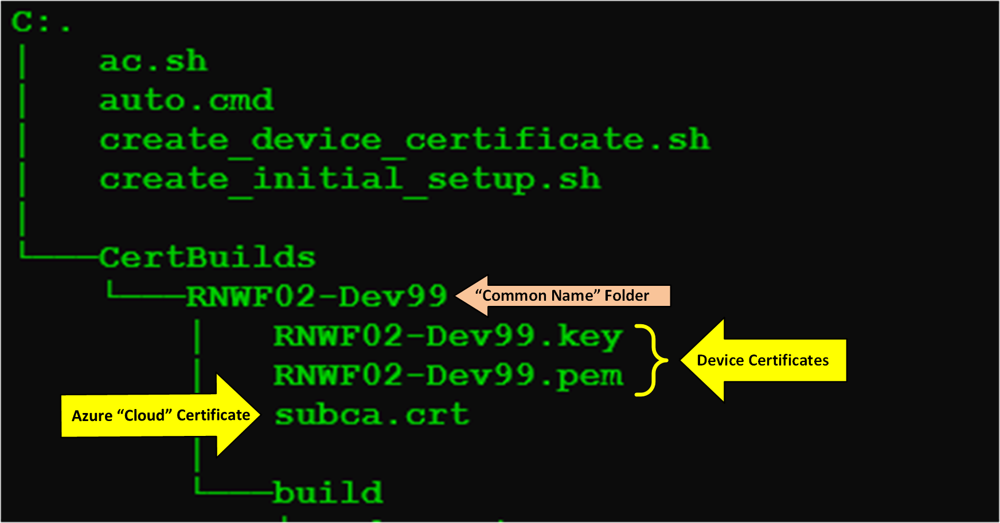
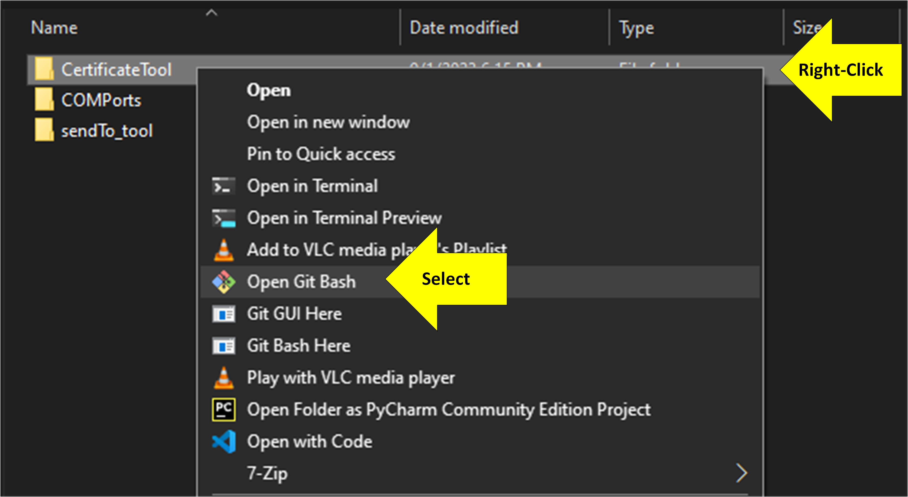
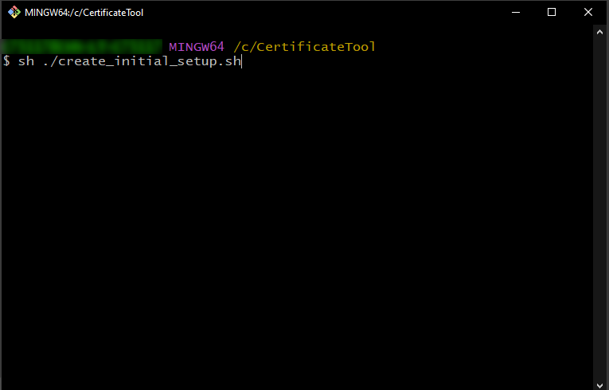
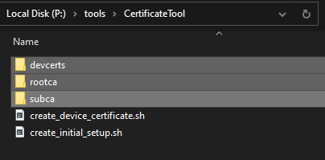
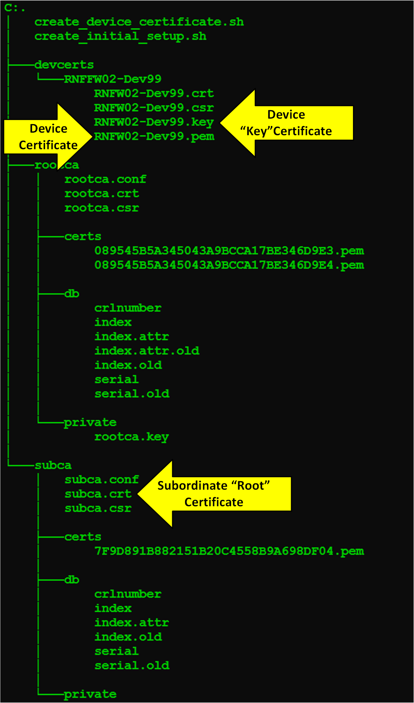

<a href="https://www.microchip.com"><p align="left"></a>

# Create Self-Signed Certificates using Git Bash
Creating the required self-signed device certificates is semi-automated and only takes a few seconds. There are 2 methods included with this tool. 

The first creates a certificate chain after entering the user chosen "Common Name". Three certificates are then created and posted in a subdirectory ready to use.

The second method involves running 2 scripts from a Git Bash terminal. The resultant certificates will then be located across several build folders for later use.

## Software
* Windows 10 or later
* Git for Windows x64, v2.40 or later.
  * https://git-scm.com/downloads
  * Includes "OpenSSL" needed to create "self-signed" certificates
  * Select all installation defaults including "Shell Integration" for Bash terminal


## First Method: "Auto.cmd"
1. Use Windows File Explorer to open the folder **"_[YOUR_PROJECT_FOLDER]_\tools\CertificateTool"**
2. Double click on the file "auto" or "auto.cmd" (if 'show file are extensions' turned on).
3. At the prompt, enter a "common name" that is no more than 23 characters long with no spaces.
4. After a moment the certificates will be generated and placed in a subdirector named after your chosen "common name".<br>
   The certificates will be located here:
   ```
   [YOUR_PROJECT_FOLDER]_\tools\CertificateTool\CertBuilds\[YOUR_COMMON_NAME]\
   ```

   | | |
   |:-:|:-:|
   |||


### First Method Results
1. After a successful run, the tool should have created a new subdirectory structure similiar to this **".\CertBuilds\\[COMMON_NAME]"**.
2. The 3 certificates needed, are located in the "common name" sub-directory. The entire "build" directory structure is also located here, but this is not needed for the demo.
   * *Note: If the script is run again using the same "common name", all 3 certificates will be different than the first run. In other words, the two  device certificates will have to be uploaded to the device again as well as the certificate to Azure!*
   


* The entire certificate build directory structure is stored in the subdirectory **".\CertBuilds\\[COMMON_NAME]\build"**.

* The same certificate files are located in the subdirectory "\build". A reference to the directory structure can be found [here](#second-method-results). Files in the build folder and can be used to create additional subordinate certificates if needed.

## Second Method: Git Bash Scripts
1. Right-click on the "CertificateTool" folder or the folder where this document exists and select "Open Git Bash"
   * If the "Open Git Bash" is not shown you will need to open "Git Bash" from the Start menu and manually navigate to the this projects subfolder "_[YOUR_PROJECT_FOLDER]_/tools/CertificateTool" folder
   * Make sure the Bash terminal is in the **"_[YOUR_PROJECT_FOLDER]_\tools\CertificateTool" folder**
  
    |File Explorer R-Click|Git Bash|
    |:------:|:-----------:|
    |||


2. Execute the first script with the command below. This will create the required directory structure for the next step.
   
       ```
        sh ./create_initial_setup.sh [ENTER]
       ```

    * At the 4 prompts, accept the "Default" by typing ENTER 4 times. **No need to change anything here!**

        ```
        Enter the folder name for Root CA(Default=rootca):-   [ENTER]
        Enter the domain suffix(Default=company.com):-        [ENTER]
        Enter the Root CA common name(Default=Custom RootCA):-[ENTER]
        Enter the folder name for Sub CA(Default=subca):-     [ENTER]
        ```

    * When complete, 3 new folders were created...

      <p align="left"></p>

3. Now the 2nd script is executed just like the first. This will create the certificates we need. For this step we need to enter 1 string value, the "Common Name" for our device such as **"RNWF02-Dev99"**. 
 
   ```
    sh ./create_device_certificate.sh [ENTER]
   ```
   At the 2nd prompt enter your unique "Common Name". 
   * Choose a unique name containing only **letters, numbers** or the **'-'** character. Take note of your common name.
   * Make sure the name is **23 characters** or less long.
   ```
    Enter the unique Device ID(Common Name):- RNWF02-Dev99 [ENTER "Common Name"]
    Enter the subCa folder(Default=subca):-                [ENTER]
   ```

### Second Method Results

Once complete, the directory structure will contain the 3 certificates needed for a secure, TLS encrypted connection to Azure. Two of those certificates are flashed into the module, while the third is uploaded to cloud provider.

| | |
|:------|:-----------:|
|'RNWF02-Dev99.key' => Device<br>'RNWF02-Dev99.pem' => Device<br><br>'subca.crt' => Azure Cloud||
