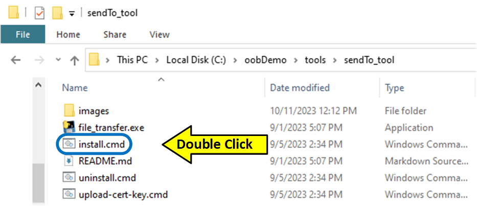
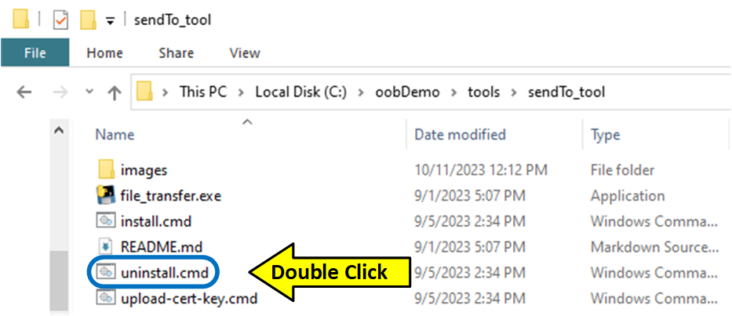
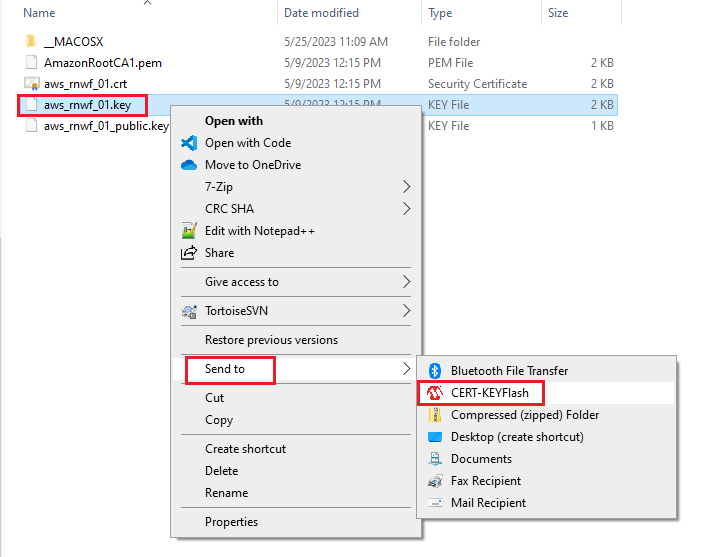
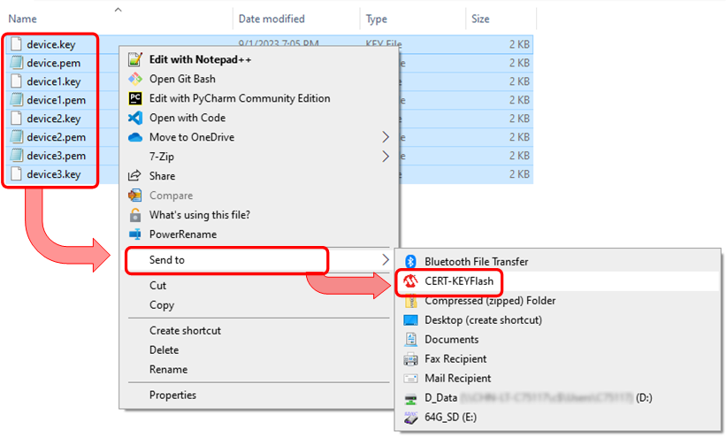

<a href="https://www.microchip.com"><p align="left"></a>

# Overview
The CERT-KEY Flash tool is used to load certificates & keys to a RNWF02PC module using Windows File Explorer's right-click menu.

## Features
* One Click Installation & Uninstallation
* Easy upload of Certificate & Keys using SendTo feature of Windows OS.
* Auto detects the COM/Serial Port of PIC32MZW2.
* Determines the File-type while uploading.
* Detects if file already exists.
* The tool is installed using only "file" copy operations.
  * The OS and registry are not modified in any way.
  * Installation files are limited to the default install directory ```C:\CertFlash```.

## Limitation
* Compatible with Windows OS's only.
* Only used to load certificates and keys

## Requirements
Microsoft Windows 8 and above

# Installation
Using Windows Explorer or the Command Prompt.

### Windows Explorer Install
* Open Windows Explorer and navigate to the tool directory.
* Double click on the **'install.cmd'** file.
<p align="left"></p>

### Command Line Install
* Open a command prompt in the "\tools" directory.
* Execute the command(s) below.
```
cd <Path_to_CERT-KEY_Flash_tool>\sendTo_tool
install.cmd
```

# Un-Install
Using Windows Explorer or the Command Prompt.

### Windows Explorer Un-Install
* Open Windows Explorer and navigate to the tool directory.
* Double click on the **'install.cmd'** file.
<p align="left"></p>

### Command Line Un-Install
* Open a command prompt in the tool directory.
* Execute the command(s) below.
``` 
cd <Path_to_CERT-KEY_Flash_tool>\sendTo_tool
uninstall.cmd
```

# Usage
* Open Windows Explorer in your certificate folder
* Right Click on Certificate or Key file and select SendTo "CERT-KEYFlash"
* To flash multiple certificate/key files at once.
  * Single left click on the first file.
  * Then press and hold the CTRL key and single left click additional files (limited to 8 files).
  * Release the CTRL key, then "Right click" on the highlighted files.
  * Finally, select the SendTo menu item "CERT-KEYFlash".

| | |
|:-:|:-:|
|<p align="left"></p>|<p align="left"></p>|
|Right-Click Single File |Right-Click Multiple Files |


